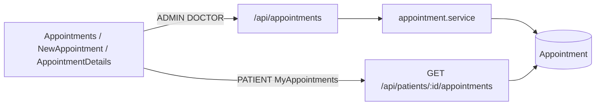
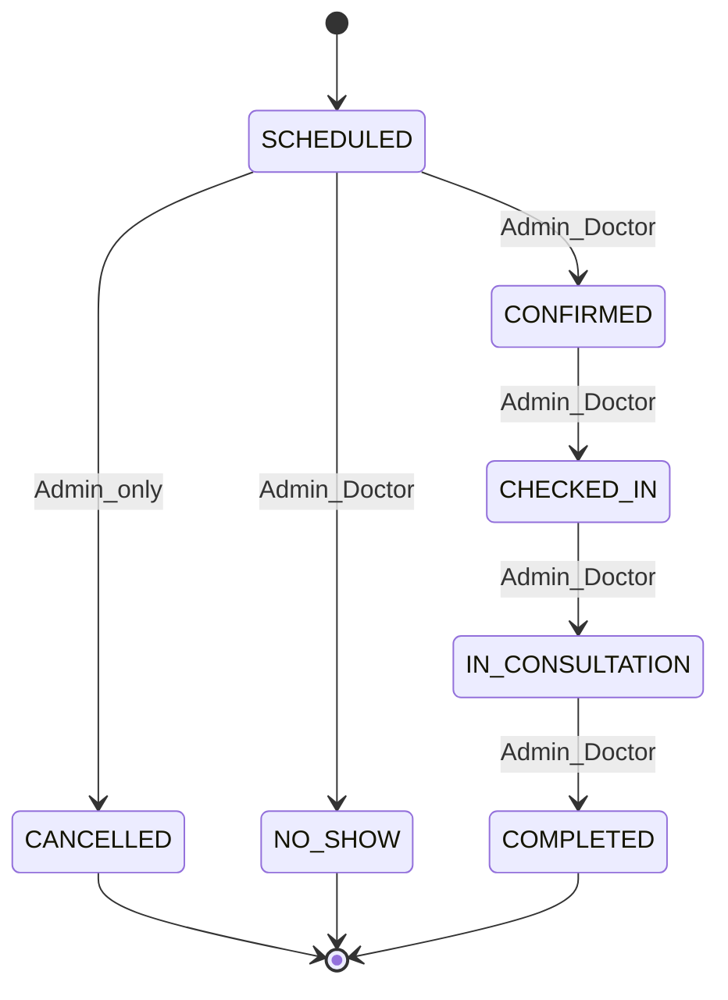

# Phase 2.1 — Appointment Lifecycle

**Status:** Inspection complete. Decisions locked: **1A** (extend enum) + **2B** (Doctor advances clinical lifecycle). **No code until you approve.**

---

## 1. Current Appointment architecture



| Layer | Location | Role today |
|---|---|---|
| Schema | [`backend/prisma/schema.prisma`](backend/prisma/schema.prisma) | `Appointment` + `AppointmentStatus` / `AppointmentType` |
| Service | [`backend/src/services/appointment.service.ts`](backend/src/services/appointment.service.ts) | CRUD helpers, overlap checks, `cancelAppointment` |
| Controller | [`backend/src/controllers/appointment.controller.ts`](backend/src/controllers/appointment.controller.ts) | Maps HTTP ↔ service; create returns **409** for all errors; update/cancel swallow to **500** |
| Routes | [`backend/src/routes/appointment.routes.ts`](backend/src/routes/appointment.routes.ts) | Auth + `authorize`; **validators not wired** |
| Validators | [`backend/src/validators/appointment.validator.ts`](backend/src/validators/appointment.validator.ts) | Zod create/update; status enum outdated vs target |
| Patient history | [`patient.routes.ts`](backend/src/routes/patient.routes.ts) + [`patient.service.ts`](backend/src/services/patient.service.ts) | `GET /patients/:id/appointments` via `requirePatientAccess` |
| FE list | [`Appointments.tsx`](frontend/src/pages/Appointments.tsx) | ADMIN+DOCTOR; New button ADMIN-only |
| FE create | [`NewAppointment.tsx`](frontend/src/pages/NewAppointment.tsx) | ADMIN route; **broken `loadFormData`** (early-return before fetch) |
| FE detail | [`AppointmentDetails.tsx`](frontend/src/pages/AppointmentDetails.tsx) | **Broken:** duplicate list page, not a detail/actions view |
| FE patient | [`MyAppointments.tsx`](frontend/src/pages/MyAppointments.tsx) | Read-only own list |
| Availability | [`Doctors.tsx`](frontend/src/pages/Doctors.tsx) `localStorage` key `doctorAvailability` | **Not server-persisted** |

Prescription/Order have **no** `appointmentId` link. Do not touch those modules.

---

## 2. Existing statuses

Defined in Prisma enum `AppointmentStatus` and mirrored in Zod:

`SCHEDULED` | `CONFIRMED` | `COMPLETED` | `CANCELLED` | `NO_SHOW`

**Missing vs target:** `CHECKED_IN`, `IN_CONSULTATION`.

Default on create: `SCHEDULED`.

---

## 3. Existing APIs

| Method | Path | Auth today | Behavior |
|---|---|---|---|
| `GET` | `/api/appointments` | ADMIN, DOCTOR | List all + patient/doctor |
| `GET` | `/api/appointments/:id` | ADMIN, DOCTOR | Get one |
| `POST` | `/api/appointments` | ADMIN | Create (past/overlap checks) |
| `PUT` | `/api/appointments/:id` | ADMIN | Partial update incl. **any** `status` — **no transition rules** |
| `DELETE` | `/api/appointments/:id` | ADMIN | Soft-cancel → `CANCELLED` (no pre-state check) |
| `GET` | `/api/patients/:id/appointments` | `requirePatientAccess` | Patient (own) / Admin / Doctor history |

**No** dedicated status endpoint today.

---

## 4. Existing business rules

**Present:**
- Duration must be &gt; 0 (service); Zod suggests 15–180 but **not applied on routes**
- Cannot schedule/update start into the past
- Doctor overlap among statuses `notIn: [CANCELLED, NO_SHOW]`
- Patient overlap with same active filter
- Cancel shortcut via DELETE

**Absent / weak:**
- No state machine (any status via PUT)
- No immutability for terminal appointments
- No explicit patient/doctor existence or doctor `ACTIVE` checks (FK failure only)
- No server-side weekly availability
- Update/cancel errors often become opaque **500**
- FE availability + create form currently unreliable

**Conflict with proposed rules:** PUT allows jumping to `COMPLETED` from `SCHEDULED`, reactivating cancelled rows, etc. Overlap treats `COMPLETED` as still “active” (blocks new bookings overlapping a completed slot)—should treat terminal statuses as inactive.

---

## 5. Existing role permissions

| Action | ADMIN | DOCTOR | PATIENT | PHARMACIST |
|---|---|---|---|---|
| List `/appointments` | yes | yes | no | no |
| Get by id | yes | yes | no | no |
| Create | yes | no | no | no |
| Update (PUT) | yes | no | no | no |
| Cancel (DELETE) | yes | no | no | no |
| Own history | via patient access | any patient | own only | no |

FE routes: `/appointments`, `/appointments/:id` → ADMIN+DOCTOR; `/appointments/new` → ADMIN; `/my/appointments` → PATIENT. Aligns with RBAC baseline; **detail UI cannot perform lifecycle actions today.**

---

## 6. Missing functionality (to build in 2.1)

- Enum values `CHECKED_IN`, `IN_CONSULTATION` + migration
- Strict allowed-transition map + role-gated transitions
- Dedicated status API (minimum new surface)
- PUT that updates schedule/details **without** free-form status; blocks edits on terminal / late states
- Cancel only from `SCHEDULED` (Admin)
- Stronger create validation (patient/doctor exist; doctor `ACTIVE`)
- Overlap “active” set excludes all terminals
- Real [`AppointmentDetails.tsx`](frontend/src/pages/AppointmentDetails.tsx) with role-matched action buttons
- Fix [`NewAppointment.tsx`](frontend/src/pages/NewAppointment.tsx) load + restore FE availability check on submit
- Wire Zod validators on appointment routes
- Map business errors to 400/403/404/409 (not blanket 500/409)

---

## 7. Proposed target lifecycle (locked)



**Forward-only, no skipping, no reverse.**

Terminal: `COMPLETED`, `CANCELLED`, `NO_SHOW`.

---

## 8. Proposed business rules (locked)

**Transitions**

| From | To | ADMIN | DOCTOR |
|---|---|---|---|
| SCHEDULED | CONFIRMED | yes | yes |
| SCHEDULED | CANCELLED | yes | **no** |
| SCHEDULED | NO_SHOW | yes | yes |
| CONFIRMED | CHECKED_IN | yes | yes |
| CHECKED_IN | IN_CONSULTATION | yes | yes |
| IN_CONSULTATION | COMPLETED | yes | yes |

All other transitions → **400** `Invalid appointment status transition`.

**Create / edit**
- Only ADMIN creates
- Only ADMIN edits schedule/details (`appointmentAt`, `duration`, `type`, `reason`, `notes`)
- Edit allowed only when status ∈ `{ SCHEDULED, CONFIRMED }`
- Cannot create/reschedule into the past
- Patient and doctor must exist; doctor `status === ACTIVE` (reject `INACTIVE` / `ON_LEAVE`)
- Doctor and patient overlap prevented for **non-terminal** statuses: `SCHEDULED`, `CONFIRMED`, `CHECKED_IN`, `IN_CONSULTATION` (exclude `COMPLETED`, `CANCELLED`, `NO_SHOW`)
- Weekly slot availability: **FE-only** via existing `localStorage` (no availability table in 2.1); BE does **not** invent slot APIs

**Immutability**
- Terminal appointments: no schedule edit, no further status change, no cancel
- Doctor cannot PUT schedule fields (route authorize)

**Roles (product — unchanged intent)**
- PATIENT: view own only; no status/create
- PHARMACIST: no appointment workflow

---

## 9. APIs to create / change

### Keep (behavior tightened)

- `GET /api/appointments`, `GET /api/appointments/:id` — unchanged auth
- `POST /api/appointments` — ADMIN; wire create schema; existence + ACTIVE doctor + overlap + past
- `PUT /api/appointments/:id` — ADMIN only; **remove `status` from update body**; schedule/details only; reject if not `SCHEDULED`/`CONFIRMED` or terminal
- `DELETE /api/appointments/:id` — ADMIN; only if `SCHEDULED` → `CANCELLED`; else 400
- `GET /api/patients/:id/appointments` — unchanged (read)

### Add (minimum new API)

`PATCH /api/appointments/:id/status`

| | |
|---|---|
| **Auth** | `authenticate` + `authorize("ADMIN", "DOCTOR")` |
| **Body** | `{ "status": "<AppointmentStatus>" }` |
| **Response 200** | `{ success: true, data: appointment }` (include patient/doctor same as get-by-id) |
| **Validation** | Zod: required `status` in full enum |
| **Logic** | Load appointment → apply transition matrix + role matrix → update |
| **Errors** | 400 invalid/missing body or illegal transition; 403 Doctor cancel or PATIENT/PHARMACIST; 404 missing id; 401 unauthenticated |

Doctor cancel attempts (DELETE or PATCH to `CANCELLED`) → **403**.

No other new appointment endpoints.

---

## 10. Exact files to modify

**Backend**
- [`backend/prisma/schema.prisma`](backend/prisma/schema.prisma) — enum values
- New Prisma migration under `backend/prisma/migrations/`
- [`backend/src/services/appointment.service.ts`](backend/src/services/appointment.service.ts) — transition map, role checks helper or service args, ACTIVE doctor, existence, active-status set, edit guards
- [`backend/src/controllers/appointment.controller.ts`](backend/src/controllers/appointment.controller.ts) — status handler; map errors to status codes
- [`backend/src/routes/appointment.routes.ts`](backend/src/routes/appointment.routes.ts) — `PATCH /:id/status`; wire `validate(...)`
- [`backend/src/validators/appointment.validator.ts`](backend/src/validators/appointment.validator.ts) — new statuses; `updateAppointmentStatusSchema`; strip status from update schema

**Frontend**
- [`frontend/src/pages/AppointmentDetails.tsx`](frontend/src/pages/AppointmentDetails.tsx) — **replace** with real detail + lifecycle actions
- [`frontend/src/pages/NewAppointment.tsx`](frontend/src/pages/NewAppointment.tsx) — fix load; validate availability on submit; surface BE errors
- [`frontend/src/pages/Appointments.tsx`](frontend/src/pages/Appointments.tsx) — status badge labels for new statuses (minimal)
- [`frontend/src/pages/MyAppointments.tsx`](frontend/src/pages/MyAppointments.tsx) — display-only new statuses (no actions)

**Out of scope (do not modify):** Patient/Prescription/Order modules, RBAC middleware design, Doctors availability persistence model, Dashboard cards (already correct enough).

---

## 11. Database / schema impact

```prisma
enum AppointmentStatus {
  SCHEDULED
  CONFIRMED
  CHECKED_IN        // NEW
  IN_CONSULTATION   // NEW
  COMPLETED
  CANCELLED
  NO_SHOW
}
```

- Migration: `ALTER TYPE "AppointmentStatus" ADD VALUE ...` (PostgreSQL; order values carefully)
- No new tables/columns
- Existing rows remain valid (`SCHEDULED` default / current values unchanged)

---

## 12. Frontend changes

**AppointmentDetails (rewrite)**
- `GET /api/appointments/:id` on load
- Show patient, doctor, time, type, duration, reason, notes, status
- Admin: Edit schedule form (only if `SCHEDULED`|`CONFIRMED`) → `PUT`
- Admin: Cancel button (only if `SCHEDULED`) → `DELETE`
- Admin + Doctor: action buttons for **allowed next statuses only** → `PATCH .../status`
  - Confirm / Check in / Start consultation / Complete / Mark no-show (visibility from same matrix as BE)
- Doctor: no create, no edit fields, no cancel
- Show API error messages inline

**NewAppointment**
- Restore `loadFormData` to fetch patients/doctors/appointments without requiring form fields
- On submit: FE weekly availability + doctor ACTIVE; then POST; show 409/400 messages

**Lists**
- Render new status strings in badges; no status editing from list rows

---

## 13. Backend changes (summary)

1. Extend enum + migrate + regenerate Prisma client  
2. Central `ALLOWED_TRANSITIONS` + `ROLE_CAN_TRANSITION(role, from, to)`  
3. `updateAppointmentStatus(id, status, role)`  
4. Tighten `createAppointment` / `updateAppointment` / `cancelAppointment`  
5. Controller error mapping: known `Error` messages → 400/403/404/409  
6. Routes: validators + PATCH before `/:id` conflict (mount `PATCH /:id/status` correctly)

---

## 14. QA scenarios enabled

| Category | Examples |
|---|---|
| Happy path | Admin creates → Doctor confirms → check-in → in consultation → complete |
| Invalid transitions | SCHEDULED→COMPLETED; COMPLETED→CONFIRMED; CANCELLED→SCHEDULED; skip CHECKED_IN |
| Cancel / no-show | Admin cancel from SCHEDULED OK; cancel from CONFIRMED 400; Doctor cancel 403; Doctor no-show from SCHEDULED OK |
| Boundary datetime | Past create 400/409; reschedule into past rejected |
| Doctor conflict | Two overlapping active appts for same doctor |
| Patient conflict | Same patient two overlapping active appts |
| Terminal overlap | New appt overlapping COMPLETED/CANCELLED/NO_SHOW **allowed** |
| AuthZ | PATIENT/PHARMACIST on PATCH/PUT/POST/DELETE → 403; Doctor PUT → 403 |
| Ownership | PATIENT `/my/appointments` only own; cannot hit admin list |
| Invalid IDs | Bad patientId/doctorId on create; bad appointment id 404 |
| Missing fields | PATCH without status; POST missing reason |
| API errors | Overlap message surfaced in FE |
| Concurrent updates | Two roles race status (last write / second may get invalid transition) — manual QA |
| Availability | FE reject outside localStorage hours; BE still accepts if FE bypassed (documented limitation) |
| Doctor inactive | Create with ON_LEAVE/INACTIVE doctor rejected |

---

## 15. Risks / dependencies

- PostgreSQL enum `ADD VALUE` migration quirks (transaction restrictions on some PG versions)
- [`AppointmentDetails.tsx`](frontend/src/pages/AppointmentDetails.tsx) is currently a list clone — rewrite is required for any lifecycle UX
- [`NewAppointment.tsx`](frontend/src/pages/NewAppointment.tsx) load bug blocks create QA until fixed
- Weekly availability remains FE-only — BE bypass possible (acceptable for 2.1; document)
- Doctor user is **not** linked to `Doctor` row — Doctor sees **all** appointments (existing limitation; do not invent assignment filtering in 2.1)
- Update controller today hides service messages as 500 — must fix for testable QA

---

## 16. Baby-step implementation order

### STEP 2.1.1 — Status model / migration
- Add `CHECKED_IN`, `IN_CONSULTATION` to Prisma enum + migration
- Update Zod enums in appointment validator
- Regenerate client; smoke that existing CRUD still runs

### STEP 2.1.2 — Transition engine + status API
- Implement transition + role matrices in service
- Add `updateAppointmentStatus`
- Add `PATCH /:id/status` (ADMIN+DOCTOR) + status Zod schema
- Remove `status` from PUT schema; cancel only from `SCHEDULED`
- Map errors to correct HTTP codes
- Manual API checks: legal/illegal transitions per role

### STEP 2.1.3 — Create/update hardening
- Existence checks for patient/doctor; doctor must be `ACTIVE`
- Active overlap set = non-terminal only
- PUT schedule edit only for `SCHEDULED`|`CONFIRMED`
- Wire `validate(createAppointmentSchema)` / `validate(updateAppointmentSchema)` on routes

### STEP 2.1.4 — Frontend details + actions
- Rewrite `AppointmentDetails.tsx` (load by id, badges, role-gated buttons, PUT/DELETE/PATCH)
- Minimal list badge support for new statuses
- MyAppointments display-only OK

### STEP 2.1.5 — Create form + FE availability
- Fix `NewAppointment` data load
- Re-attach weekly availability + ACTIVE doctor checks on submit
- Surface backend conflict/validation messages

### STEP 2.1.6 — End-to-end verification
- Four-role matrix: Admin full path; Doctor advance/no-show no-cancel; Patient read-only; Pharmacist no access
- Invalid transition + overlap + past + inactive doctor + terminal immutability
- Confirm FE buttons match BE (no “click then 403” for hidden actions)

**Stop after each step for your approval if you want gated delivery; otherwise run 2.1.1→2.1.6 as one approved Phase 2.1.**
