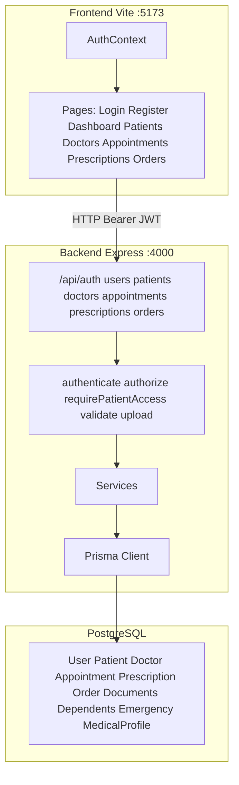
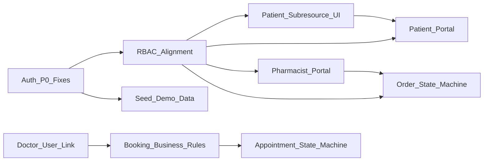

# Healthcare Automation App — Discovery & Development Roadmap

**Scope of this document:** discovery + planning only. No implementation has been performed.

**Default roadmap emphasis:** stabilize critical bugs first, then complete role portals and workflow/business rules together (balanced). Prefer features that create strong QA scenarios (RBAC boundaries, state transitions, conflicts, validation, UI/API mismatches).

---

## A. PROJECT OVERVIEW

A split-stack **healthcare practice / QA training application** (not production healthcare software).

| Layer | Stack |
|---|---|
| Frontend | React 19, TypeScript, Vite 8, React Router 7, Axios (mostly unused), CSS |
| Backend | Express 5, TypeScript (`tsx` for dev), Zod, JWT, bcrypt, Multer |
| Database | PostgreSQL via Prisma ORM 7 (`@prisma/adapter-pg`) |
| Auth | JWT Bearer tokens; account lockout; password reset tokens |

**Purpose (from product intent + code):** provide realistic multi-role CRUD, RBAC, validation, conflicts, and workflow scenarios for QA practice.

There is **no root README**, no monorepo root `package.json`, no Docker Compose, no Prisma seed file, and no automated test suite in app source.

---

## B. CURRENT ARCHITECTURE



**Backend layout (verified):**
- Entry: [`backend/src/server.ts`](backend/src/server.ts) — port **4000**, mounts `/api/*`
- Routes / controllers / services / middleware / validators under [`backend/src/`](backend/src/)
- Prisma schema: [`backend/prisma/schema.prisma`](backend/prisma/schema.prisma)
- Config: [`backend/prisma.config.ts`](backend/prisma.config.ts), [`backend/src/config/prisma.ts`](backend/src/config/prisma.ts)
- Admin bootstrap script: [`backend/src/scripts/create-admin.ts`](backend/src/scripts/create-admin.ts) (not wired in `package.json`)

**Frontend layout (verified):**
- Entry: [`frontend/src/main.tsx`](frontend/src/main.tsx) + [`frontend/src/App.tsx`](frontend/src/App.tsx)
- Auth: [`frontend/src/context/AuthContext.tsx`](frontend/src/context/AuthContext.tsx)
- Pages under [`frontend/src/pages/`](frontend/src/pages/)
- API helper [`frontend/src/services/api.ts`](frontend/src/services/api.ts) exists but is **never imported** (dead code); pages use raw `fetch` to `http://localhost:4000/api`

---

## C. LOCAL RUNNING INSTRUCTIONS

Verified from `package.json` / Vite defaults / `server.ts`. **Do not assume `.env` contents** — no `.env` or `.env.example` is committed.

### FRONTEND LOCAL RUN
1. Navigate to: `frontend/`
2. Install dependencies: `npm install`
3. Start command: `npm run dev` (`vite`)
4. Expected local URL: `http://localhost:5173` (Vite default; no custom port in [`frontend/vite.config.ts`](frontend/vite.config.ts))

Other scripts: `npm run build` (`tsc -b && vite build`), `npm run lint`, `npm run preview`. No dedicated typecheck-only script beyond build.

### BACKEND LOCAL RUN
1. Navigate to: `backend/`
2. Install dependencies: `npm install`
3. Start command: `npm run dev` (`tsx watch src/server.ts`)
4. Expected local URL: `http://localhost:4000` (health: `GET /api/health`)

Other scripts: `npm run build` (`tsc`), `npm start` (`node dist/server.js`). **No** prisma/migrate/seed/typecheck scripts in [`backend/package.json`](backend/package.json).

### DATABASE
1. **Technology:** PostgreSQL
2. **Prisma commands available:** CLI via `npx prisma ...` (dependency present). Common expected commands (not package scripts): `npx prisma migrate dev`, `npx prisma generate`, `npx prisma studio`. Migrations exist under [`backend/prisma/migrations/`](backend/prisma/migrations/).
3. **Local DB config:** `DATABASE_URL` required (`backend/src/config/prisma.ts` throws if missing; also read by `prisma.config.ts`). Exact connection string: **Not determinable from the current codebase** (env not committed).
4. **Migrations required:** Yes — schema evolved via numbered migrations; DB must be migrated before API use.
5. **Seed data:** No `prisma/seed` / seed script found.
6. **Sample data creation:** Manual via UI/API, plus optional admin bootstrap: `npx tsx src/scripts/create-admin.ts` (defaults `admin@healthcare.local` / `Admin@12345` unless `ADMIN_EMAIL` / `ADMIN_PASSWORD` set). JWT uses `JWT_SECRET` if set.

**Also typically needed after install:** `npx prisma generate` (client output is `backend/src/generated/prisma`).

---

## D. COMPLETED MODULES

| Module | Status | Why |
|---|---|---|
| Auth — Login | ✅ COMPLETE (with bugs below) | API + UI; remember-me; lockout; status checks |
| Auth — Register (public) | 🟡 PARTIAL | Works for PATIENT (+ profile); DOCTOR/PHARMACIST create User only |
| Auth — Logout | 🟡 PARTIAL | Backend contract exists; frontend clears storage only (does not call API) |
| Auth — Change password | 🟡 PARTIAL | Backend + page exist; no nav link from Dashboard |
| Users (Admin API) | 🟡 PARTIAL | Full CRUD API ADMIN-only; **no frontend Users UI**; create expects raw `passwordHash` |
| Patients CRUD | 🟡 PARTIAL | List/create/update/deactivate strong on Admin/Doctor UI; delete API only; create may fail Zod datetime |
| Doctors CRUD | 🟡 PARTIAL | Strong Admin UI + list; Doctor read-only-ish; availability is **localStorage mock** |
| Appointments list/create/cancel (Admin) | 🟡 PARTIAL | Conflict detection backend; Admin create UI; limited status workflow UI |
| Prescriptions (Admin/Doctor path) | 🟡 PARTIAL | Nested under patient; create/status/delete; Pharmacist API without FE routes |
| Orders (Admin path) | 🟡 PARTIAL | Nested under patient; status/payment; FE/BE role mismatches |
| Health check | ✅ COMPLETE | `/api/health` with DB ping |

---

## E. PARTIALLY COMPLETED / INCOMPLETE MODULES

| Module | Classification | Notes |
|---|---|---|
| Password reset | 🐛 HAS KNOWN ISSUES | Backend returns `resetToken` in dev; Forgot UI does not show/link it; Reset UI sends `password` but API expects `newPassword` |
| Patient portal | 🔴 INCOMPLETE | Register creates linked `Patient`; almost no PATIENT frontend routes; Dashboard cards navigate to blocked routes |
| Pharmacist portal | 🔴 INCOMPLETE | Role exists; Dashboard shows Patients; routes blocked; order/prescription APIs partially allow PHARMACIST |
| Patient dependents | 🔴 INCOMPLETE | Full backend routes; **no frontend UI** |
| Emergency contact | 🔴 INCOMPLETE | Full backend; **no frontend UI** |
| Medical profile | 🔴 INCOMPLETE | Full backend; **no frontend UI** |
| Patient documents | 🔴 INCOMPLETE | Upload/download/delete backend + multer; PatientDetails “Documents” card has **no click handler** |
| Patient appointment history API | 🟡 PARTIAL | `GET /patients/:id/appointments` exists; history cards on details are non-navigating |
| Doctor ↔ User link | 🔴 INCOMPLETE | `Doctor` domain model has **no `userId`**; registering as DOCTOR does not create `Doctor` row |
| SUPPORT / VIEWER roles | 🔴 INCOMPLETE | In Prisma enum; almost unused in routes/UI |
| Search/filter/sort/pagination | 🟡 PARTIAL | Strong on Patients & Doctors (client-side); light on Appointments/Orders; **no server-side pagination** |
| Shared API client | 🔴 INCOMPLETE | `api.ts` unused; inconsistent token reads (`localStorage` only vs both storages) |

---

## F. KNOWN BUGS (QA-style audit)

Priority: **P0** blocker / **P1** high / **P2** medium / **P3** low

| Issue | Where | Why / Impact | Suggested fix | Priority |
|---|---|---|---|---|
| JWT default secret mismatch | [`auth.service.ts`](backend/src/services/auth.service.ts) (`development-secret`) vs [`auth.ts`](backend/src/middleware/auth.ts) (`local-development-secret`) | If `JWT_SECRET` unset, login tokens fail authenticate | Unify default secret | **P0** |
| Reset password API contract mismatch | FE [`ResetPassword.tsx`](frontend/src/pages/ResetPassword.tsx) sends `password`; BE expects `newPassword` | Reset flow always fails | Align field name | **P0** |
| Forgot-password UX broken for local QA | FE does not surface `resetToken`; BE logs to console | Cannot complete reset without console | Dev-mode show token / link to `/reset-password?token=` | **P0** |
| Create patient Zod datetime | FE date input `YYYY-MM-DD`; [`patient.validator.ts`](backend/src/validators/patient.validator.ts) `.datetime()` | Create patient from UI likely fails validation | Accept date or convert ISO on FE | **P0** |
| Remember-me / token read inconsistency | [`api.ts`](frontend/src/services/api.ts), [`NewAppointment.tsx`](frontend/src/pages/NewAppointment.tsx), parts of Doctors: localStorage only | Session-only login breaks some API calls | Centralize token helper (context or both storages) | **P1** |
| Dashboard nav vs route guards | [`Dashboard.tsx`](frontend/src/pages/Dashboard.tsx) vs [`App.tsx`](frontend/src/App.tsx) | PATIENT→Appointments, PHARMACIST→Patients redirect to dashboard | Align cards with allowed routes / build portals | **P1** |
| Order create role mismatch | FE allows non-pharmacist (Admin/Doctor) create; BE `authorize("ADMIN","PATIENT")` | Doctor UI create fails 403; Patient can create via API but has no UI | Align roles intentionally | **P1** |
| Order list role mismatch | FE routes Admin/Doctor; BE list `ADMIN`,`PHARMACIST` | Doctor sees page but order APIs 403; Pharmacist blocked from FE | Align | **P1** |
| History cards dead | [`PatientDetails.tsx`](frontend/src/pages/PatientDetails.tsx) | No `onClick`/`navigate` for appointments/prescriptions/orders/documents | Wire navigation | **P1** |
| `changePasswordController` types | uses `req.user` on untyped `Request` | TS build risk (`npm run build`) | Use `AuthRequest` | **P2** |
| Admin create user stores `passwordHash` as provided | [`user.service.ts`](backend/src/services/user.service.ts) | No bcrypt; may store plaintext | Accept password and hash | **P2** |
| User validators omit `PATIENT` | [`user.validator.ts`](backend/src/validators/user.validator.ts) | Cannot assign PATIENT via admin user API | Add PATIENT to enum | **P2** |
| Appointment validators unused | [`appointment.validator.ts`](backend/src/validators/appointment.validator.ts) not on routes | Weaker API validation vs other modules | Wire `validate()` | **P2** |
| Patient create does not set `userId` | [`patient.service.ts`](backend/src/services/patient.service.ts) | Admin-created patients not linkable to PATIENT login | Optional link / invite flow | **P2** |
| Doctor availability not persisted server-side | [`Doctors.tsx`](frontend/src/pages/Doctors.tsx) localStorage | Multi-browser/user inconsistency; good QA trap if intentional | Backend model or document as client-only | **P2** |
| No link to Change Password | Dashboard | Feature hard to discover | Add nav | **P3** |
| Unused `api.ts` | frontend services | Drift / dead code | Adopt or remove later | **P3** |

---

## G. RBAC GAPS

### Roles in schema
`ADMIN`, `DOCTOR`, `PHARMACIST`, `PATIENT`, `SUPPORT`, `VIEWER`

### Backend matrix (high level)

| Resource | ADMIN | DOCTOR | PATIENT | PHARMACIST |
|---|---|---|---|---|
| Auth (register public) | blocked | yes (User only) | yes (+Patient) | yes (User only) |
| Users CRUD | full | no | no | no |
| Patients list/create/deactivate | yes | yes | no list | no |
| Patient by id / update / dependents / emergency / medical / appt history | any | any | **own only** (`requirePatientAccess`) | **no** |
| Documents upload/delete | yes | yes | no | no |
| Documents list/download | any | any | own | no |
| Doctors read | yes | yes | no | no |
| Doctors write/delete | yes | no | no | no |
| Appointments read | yes | yes | no | no |
| Appointments create/update/cancel | yes | no | no | no |
| Prescriptions read/status | yes | yes | no | yes |
| Prescriptions create/delete | yes | yes | no | no |
| Orders read/status/payment | yes | **no** | no | yes |
| Orders create | yes | **no** | yes | no |
| Orders delete | yes | no | no | no |

### Frontend route matrix ([`App.tsx`](frontend/src/App.tsx))

| Route | Roles |
|---|---|
| `/dashboard`, `/change-password` | any authenticated |
| `/patients`, `/doctors`, `/appointments`, details, prescriptions, orders | **ADMIN, DOCTOR only** |
| `/appointments/new` | **ADMIN only** |
| PATIENT / PHARMACIST module routes | **none** |

### Gap categories found
1. **Frontend allows / Backend blocks:** Doctor create order UI; Doctor view orders UI calling order APIs
2. **Backend allows / Frontend hides:** Pharmacist prescriptions/orders APIs; Patient own patient APIs; Patient create order API; Patient update own record
3. **Frontend hides but direct URL works:** Only within allowed roles; unauthenticated → login; wrong role → `/dashboard` (not 403 page)
4. **Unauthorized API by role:** SUPPORT/VIEWER can authenticate but get almost nothing; PHARMACIST blocked from patient records despite dashboard messaging
5. **Role missing from module:** PHARMACIST/PATIENT missing from most FE modules; Doctor entity not tied to DOCTOR user
6. **Inconsistent across modules:** Orders vs Prescriptions role sets diverge; document upload vs medical profile ownership rules differ

---

## H. BUSINESS-RULE GAPS

**Present today:**
- Appointment overlap (doctor + patient), past-date block, duration > 0
- Login lockout (5 attempts / 15 min), inactive/locked status
- Password change must differ; reset token single-use / 15 min
- Prescription requires ≥1 valid item; order requires items + totals
- Patient deactivate idempotency (`PATIENT_ALREADY_INACTIVE`)
- Document mime/size limits (10MB)

**Missing / weak (high QA value):**
- Appointment status state machine (any status currently settable without transition rules)
- Order/payment transition rules (e.g. cannot SHIP after CANCELLED; payment vs delivery consistency)
- Prescription cannot be edited after COMPLETED/CANCELLED; refill / pharmacy dispense workflow
- Cannot book against INACTIVE patient / ON_LEAVE doctor
- Doctor User must map to Doctor profile
- Patient-owned order must enforce `patientId` ownership (currently PATIENT can POST any `patientId`)
- Concurrent booking race (no transaction/locking around conflict check + create)
- Audit/history of status changes
- Server-side search/filter/pagination

---

## I. MISSING FEATURES (only if QA-valuable)

- Patient self-service portal (profile, appointments view, orders, documents download)
- Pharmacist portal (prescription queue, order fulfillment)
- Link Doctor user ↔ Doctor record; Pharmacist identity model (none today)
- Dependents / emergency / medical profile UIs
- Document management UI
- Admin Users management UI
- Formal status workflow engines
- Seed dataset for multi-role QA scenarios
- `.env.example` + runbook documentation
- Central API client + consistent error/loading/empty patterns
- Server-side list APIs with query params

**Explicitly not recommending:** production infra (SSO, HIPAA tooling, Kubernetes, message buses, etc.)

---

## J. TOP 10 RECOMMENDED NEXT FEATURES

1. **Auth contract stabilization** (JWT secret, reset password body, forgot-token UX, token storage) — Complexity: Low — QA: high (auth negative paths)
2. **Patient create date validation fix + appointment validator wiring** — Low — QA: validation boundaries
3. **RBAC alignment pass** (FE routes ↔ BE authorize ↔ Dashboard cards) — Medium — QA: permission matrix testing
4. **Patient portal MVP** (my profile, my appointments, my orders create/view, own documents download) — High — QA: ownership boundaries
5. **Pharmacist portal MVP** (patient search limited, prescriptions status, orders fulfill) — High — QA: cross-role workflows
6. **Wire PatientDetails history + documents/dependents/emergency/medical UIs** — Medium — QA: nested CRUD + files
7. **Doctor↔User linking + inactive/on-leave booking rules** — Medium — QA: data dependency negatives
8. **Appointment status workflow** (SCHEDULED→CONFIRMED→COMPLETED/NO_SHOW/CANCELLED) — Medium — QA: state transitions
9. **Order/payment state machine + ownership checks** — Medium — QA: illegal transitions
10. **Seed script + demo accounts for all roles** — Low/Medium — QA: repeatable scenarios

---

## K. RECOMMENDED MODULE ORDER

1. Stabilization / auth contracts  
2. RBAC matrix consistency  
3. Complete patient sub-resources UI (existing APIs)  
4. Patient portal  
5. Pharmacist portal  
6. Doctor identity linking + booking rules  
7. Appointment/order/prescription workflows  
8. List API enhancements (search/filter/sort/pagination server-side)  
9. Seed data + docs polish  

---

## L. FEATURE DEPENDENCIES



---

## M. COMPLEXITY / N. QA VALUE (summary)

| Phase item | Complexity | QA value |
|---|---|---|
| Auth/P0 fixes | Low | Very high |
| RBAC alignment | Medium | Very high |
| Patient sub-resource UIs | Medium | High (CRUD + files) |
| Patient/Pharmacist portals | High | Very high (role workflows) |
| State machines | Medium | Very high (transitions/negatives) |
| Server pagination/filter | Medium | High |
| Seed + docs | Low–Medium | High (setup reproducibility) |

---

## O. FINAL RECOMMENDED DEVELOPMENT ROADMAP

### PHASE 0 — Stabilization / Bug Fixes
- Unify JWT secret defaults; document `JWT_SECRET` / `DATABASE_URL`
- Fix reset password request body (`newPassword`)
- Surface reset token/link in local/dev forgot-password flow
- Fix patient `dateOfBirth` validation FE↔Zod
- Centralize token retrieval (remember-me safe)
- Wire dead PatientDetails history navigation
- Align order create/list roles **or** intentionally document mismatch after choosing product rules

### PHASE 1 — Complete Existing Modules
- Dependents, emergency contact, medical profile, documents UIs on patient details
- Change-password / account links in shell navigation
- Admin Users UI (with proper password hashing)
- Wire appointment Zod validators on routes
- Decide/document doctor availability: persist to API or keep as client-only QA trap with labeling

### PHASE 2 — Business Rules / Complex Workflows
- Appointment status transitions + who can change them (Admin vs Doctor)
- Cannot schedule inactive patient / on-leave doctor
- Order status + payment transition rules; cancel constraints
- Prescription terminal-state rules; pharmacist status updates only
- Enforce PATIENT can only create/read **own** orders/records
- Doctor User ↔ Doctor profile linkage

### PHASE 3 — Advanced Application Scenarios
- Patient portal + Pharmacist portal end-to-end
- Server-side search/filter/sort/pagination on list endpoints
- Concurrent booking conflict scenarios (transactional create)
- Optional lightweight audit/status history for appointments/orders
- Multi-step: appointment completed → create prescription → create pharmacy order

### PHASE 4 — Final Application Polish
- Seed script with ADMIN/DOCTOR/PATIENT/PHARMACIST + sample graph data
- `.env.example` + root README runbook (local FE/BE/DB)
- Consistent loading/empty/error states; adopt shared API client
- Remove or adopt dead code (`api.ts`); SUPPORT/VIEWER either implemented minimally or removed from public surface

---

## Business model (verified from Prisma + services)

```text
User (role, status, security, reset tokens)
 └── Patient? (optional userId)     ← only auto-created on PATIENT register
Doctor                              ← NOT linked to User
Patient
 ├── Appointments → Doctor
├── Prescriptions → Doctor → PrescriptionItems
├── Orders → OrderItems
├── PatientDocuments
├── PatientDependents
├── PatientEmergencyContact (1:1)
└── PatientMedicalProfile (1:1)
```

**Important:** `User.role === DOCTOR` ≠ `Doctor` row. Pharmacist has **no** domain profile table.

---

## Module status legend (requested)

- ✅ COMPLETE — Auth health, core Admin/Doctor patient & doctor list UIs largely usable  
- 🟡 PARTIALLY COMPLETE — Auth extras, appointments, prescriptions, orders, patients  
- 🔴 INCOMPLETE — Patient/Pharmacist portals, dependents/emergency/medical/documents UI, doctor-user link, SUPPORT/VIEWER  
- 🐛 HAS KNOWN ISSUES — Password reset, JWT defaults, date validation, RBAC FE/BE mismatches, dead history cards  

After you approve this roadmap, implementation should start with **Phase 0** only unless you specify otherwise.
