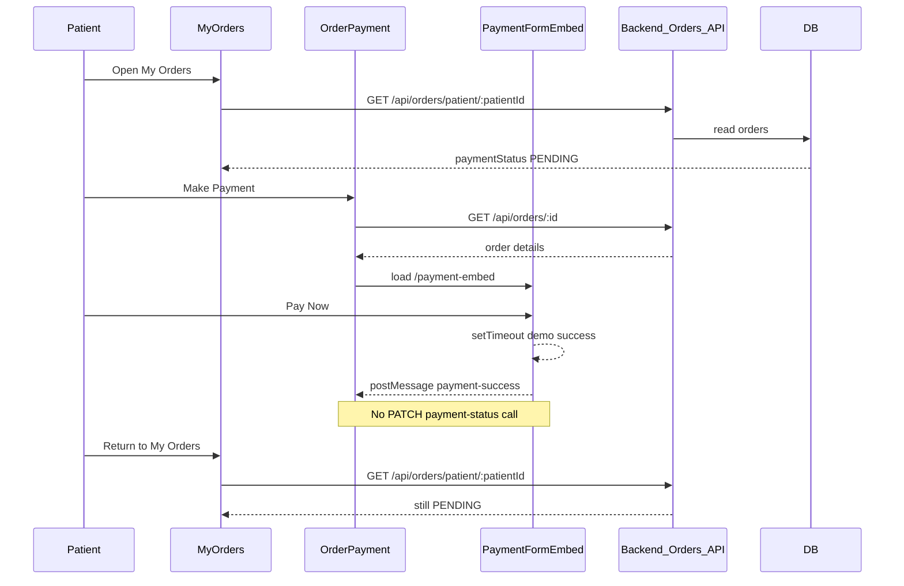

# Patient Payment Status Investigation

## Verdict

The inconsistent UI is **expected given the current implementation**. Payment success is **not persisted**. Returning to My Orders correctly reloads `PENDING` from the API/database.

---

## 1. Current payment flow

Relevant code:

- Iframe demo only ([frontend/src/pages/PaymentFormEmbed.tsx](frontend/src/pages/PaymentFormEmbed.tsx)): validates card fields, simulates decline if card ends in `0000`, otherwise sets local success and `postMessage`s to parent. **No `fetch` to any payment API.**
- Parent ([frontend/src/pages/OrderPayment.tsx](frontend/src/pages/OrderPayment.tsx)): on `payment-success`, only updates React state (`paymentState`, `paymentMessage`). **Does not update `order.paymentStatus` or call the backend.**
- List ([frontend/src/pages/MyOrders.tsx](frontend/src/pages/MyOrders.tsx)): always loads payment from `GET /api/orders/patient/:patientId`.

---

## 2. Why status remains PENDING

1. Success is **frontend-only** (iframe + parent `postMessage`).
2. Database field `Order.paymentStatus` is never updated by this flow.
3. My Orders **re-fetches** from the API, so it shows the stored value: `PENDING`.
4. Even if the frontend tried to call the existing update API, **PATIENT is not authorized** on it today (see below).

---

## 3. Existing APIs involved

| Method | Path | Roles | Used by patient payment? |
|--------|------|-------|--------------------------|
| GET | `/api/orders/patient/:patientId` | ADMIN, PHARMACIST, PATIENT | Yes — list |
| GET | `/api/orders/:id` | ADMIN, PHARMACIST, PATIENT | Yes — load order for pay/track |
| POST | `/api/orders` | ADMIN, PATIENT | Create only |
| PATCH | `/api/orders/:id/status` | ADMIN, PHARMACIST | No (order fulfillment) |
| PATCH | `/api/orders/:id/payment-status` | **ADMIN, PHARMACIST only** | **No — patient payment does not call this** |
| DELETE | `/api/orders/:id` | ADMIN | No |

Source: [backend/src/routes/order.routes.ts](backend/src/routes/order.routes.ts).

Who currently updates payment in the UI:

- [frontend/src/pages/PharmacyWorkspace.tsx](frontend/src/pages/PharmacyWorkspace.tsx) (pharmacist)
- [frontend/src/pages/PatientOrders.tsx](frontend/src/pages/PatientOrders.tsx) (admin)

Both call `PATCH /api/orders/:id/payment-status` with body `{ paymentStatus }`.

Service: [backend/src/services/order.service.ts](backend/src/services/order.service.ts) `updatePaymentStatus` — simple Prisma update of `paymentStatus` only (no coupling to `status`).

---

## 4. Existing database fields

From [backend/prisma/schema.prisma](backend/prisma/schema.prisma) `Order` model:

- `status` — `OrderStatus` default `PENDING`
  - Values: `PENDING`, `CONFIRMED`, `PROCESSING`, `SHIPPED`, `DELIVERED`, `CANCELLED`
- `paymentStatus` — `PaymentStatus` default `PENDING`
  - Values: `PENDING`, `PAID`, `FAILED`, `REFUNDED`

These fields are **independent**. Paying does not automatically advance order status; shipping does not require payment in DB constraints.

No schema change is required to store a successful patient payment as `PAID`.

---

## 5. Current order / payment lifecycle (as implemented)

**Order fulfillment (`status`)** — pharmacy/admin driven via `PATCH .../status`:

`PENDING → CONFIRMED → PROCESSING → SHIPPED → DELIVERED` (also `CANCELLED`)

**Payment (`paymentStatus`)** — pharmacy/admin driven today via `PATCH .../payment-status`:

`PENDING → PAID | FAILED | REFUNDED` (no enforced transition rules in service)

**Patient portal today:**

- Create order → both fields default `PENDING`
- Make Payment → UI success only
- Track Shipment button → only if `status` is `PROCESSING` | `SHIPPED` | `DELIVERED` ([MyOrders.tsx](frontend/src/pages/MyOrders.tsx) `canTrackShipment`)
- Make Payment button → if `paymentStatus` is `PENDING` | `FAILED`

---

## 6. Where Track Shipment already is / should appear

**Already exists:**

- Route: `/my/orders/:orderId/tracking` ([App.tsx](frontend/src/App.tsx), [ShipmentTracking.tsx](frontend/src/pages/ShipmentTracking.tsx))
- Entry: **Track Shipment** on My Orders Actions column when order status is `PROCESSING` / `SHIPPED` / `DELIVERED`
- Opens in a **new tab**; loads order via `GET /api/orders/:id`; demo tracking derived from order data (no external carrier)

**Logical placement (recommended business view):**

- Keep Track Shipment on **My Orders** (and the dedicated tracking page).
- Show it when the order is in transit / fulfilled (`PROCESSING+`), ideally after payment is settled in a real clinic flow—but the current model does not enforce payment-before-ship at the DB layer.
- Do **not** put Track Shipment on the payment page as the primary entry.

---

## 7. Recommended implementation approach (awaiting your approval)

**Goal:** After demo Pay Now success, My Orders should show `PAID` (and hide Make Payment). Decline can set `FAILED`.

**Chosen approach (minimal, reuse existing API — no new endpoint, no Prisma change):**

1. **Authorize PATIENT on existing** `PATCH /api/orders/:id/payment-status`, but only for their own order via the existing ownership helper pattern already used in [order.controller.ts](backend/src/controllers/order.controller.ts) (`assertPatientOwnsPatientId`).
2. Restrict patient-allowed values to **`PAID` and `FAILED` only** (not `REFUNDED` / arbitrary staff values) in the controller when role is PATIENT.
3. On iframe **success**, [OrderPayment.tsx](frontend/src/pages/OrderPayment.tsx) (or embed via parent) calls `PATCH .../payment-status` with `{ paymentStatus: "PAID" }` using the patient JWT; on **decline**, call with `"FAILED"`.
4. On API success, update local order state and/or navigate back to My Orders so the list refetch shows the new status.
5. Leave order `status` advancement to ADMIN/PHARMACIST (existing Pharmacy / Patient Orders UIs). Do not auto-SHIP on pay unless you later request that.
6. Leave Track Shipment gating as-is (`PROCESSING`/`SHIPPED`/`DELIVERED`), unless you want to also require `paymentStatus === PAID` (optional product rule — default: keep current gating).

**Out of scope unless you ask:** real payment provider, new APIs, schema/migrations, changing pharmacist/admin payment UIs, auto-advancing order status on pay.

---

## What I will not do until you approve

- No code changes
- No new APIs
- No Prisma/schema changes
- No unrelated order refactors
