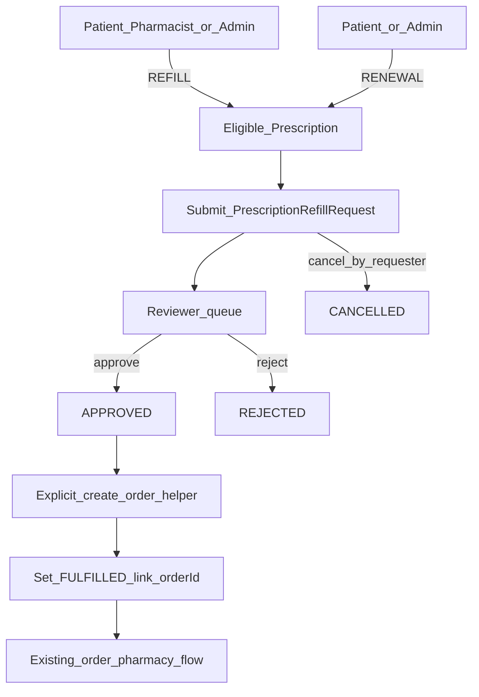

# PHASE A — Prescription Refill / Renewal Requests (Implementation Plan)

**Status:** PLAN / INSPECTION ONLY — do not implement until explicit approval.

**Roadmap conflict (report only — file not modified):** [`docs/NEXT_PRODUCT_FEATURES.md`](docs/NEXT_PRODUCT_FEATURES.md) currently contains the *drafting plan* for the master roadmap (frontmatter + outline), not a fully written permanent roadmap document. Phase A still clearly appears as priority #1 / PHASE A in that file’s sketch ([Feature 1](docs/NEXT_PRODUCT_FEATURES.md) ~lines 173–175). **Options:** (1) proceed with this plan + that sketch as Phase A authority; (2) separately rewrite the roadmap doc later (out of scope for Phase A implementation). This plan proceeds with **option 1**.

**Doc staleness note:** [`docs/API_INVENTORY.md`](docs/API_INVENTORY.md) lists `PATCH /api/orders/:id/payment-status` as ADMIN/PHARMACIST only; live code in [`backend/src/routes/order.routes.ts`](backend/src/routes/order.routes.ts) also authorizes **PATIENT**. Prefer code as source of truth.

---

## 1. Current-state findings

### Prescription (EXISTING)

| Area | Finding |
|------|---------|
| Models | `Prescription`, `PrescriptionItem` in [`backend/prisma/schema.prisma`](backend/prisma/schema.prisma) |
| Statuses | `ACTIVE`, `COMPLETED`, `CANCELLED` only — **no** transition matrix (any status patch accepted) |
| Missing fields | **No** `expiresAt`, refill count, remaining refills, Rx↔Order FK |
| APIs | `GET /patient/:patientId`, `GET /:id`, `POST /`, `PATCH /:id/status`, `DELETE /:id` under `/api/prescriptions` |
| RBAC | List/get/status: ADMIN, DOCTOR, **PHARMACIST**. Create/delete: ADMIN, DOCTOR. **PATIENT has zero prescription API access** |
| Validators | **No** `prescription.validator.ts` — validation inline in [`prescription.service.ts`](backend/src/services/prescription.service.ts) |
| UI | [`PatientPrescriptions.tsx`](frontend/src/pages/PatientPrescriptions.tsx) — ADMIN/DOCTOR route only (`/patients/:id/prescriptions`). Pharmacy uses [`PharmacyWorkspace.tsx`](frontend/src/pages/PharmacyWorkspace.tsx) |

### Patient / portal (EXISTING)

- Ownership via `Patient.userId` + [`requirePatientAccess`](backend/src/middleware/patient-access.ts) on patient routes; order controllers use parallel ownership asserts.
- Patient portal: profile, appointments (**view-only**), orders create/list/pay/track — **no prescriptions UI**.

### Pharmacy (EXISTING)

- PHARMACIST: `/pharmacy` only; lookup Rx/orders by ID; patch Rx status and order/payment status.
- PHARMACIST **cannot** `POST /api/orders` (ADMIN + PATIENT only).

### Orders (EXISTING)

- `Order` / `OrderItem` free-text `productName`; statuses PENDING→…→DELIVERED/CANCELLED; payment PENDING/PAID/FAILED/REFUNDED.
- **No** `prescriptionId` / refill-request link on orders.
- Patient can create orders ([`MyOrders.tsx`](frontend/src/pages/MyOrders.tsx)); admin via [`PatientOrders.tsx`](frontend/src/pages/PatientOrders.tsx).

### Auth / RBAC (EXISTING)

Roles in schema: ADMIN, DOCTOR, PHARMACIST, PATIENT, SUPPORT, VIEWER. SUPPORT/VIEWER are **not** on prescription/order authorize lists today. JWT `authenticate` + `authorize(...)` remain the security boundary.

---

## 2. Existing functionality to reuse

- `Prescription` + items as source of medicines for requests and for order line mapping
- `POST /api/orders` (ADMIN/PATIENT + ownership) for fulfillment supply
- Order status + payment + pharmacy processing unchanged
- Ownership patterns from order controller / `requirePatientAccess`
- Appointment-style **separate** status transition service pattern ([`appointment.service.ts`](backend/src/services/appointment.service.ts) `ALLOWED_TRANSITIONS` + role targets) as the model for the **new** request lifecycle — without changing appointment code
- Pharmacy Workspace + PatientPrescriptions as extension points for review UI
- Patient My Orders portal for post-approval order placement

---

## 3. Missing functionality (genuinely new)

- Request entity for REFILL vs RENEWAL
- Request lifecycle + role-gated transitions
- Patient visibility of own prescriptions (API + UI) — **required** for patient-initiated requests
- Review queue for pharmacist/doctor
- Link from approved request → order (no FK today)
- Server rules for eligibility, duplicates, rejection reason, cancel

**Not duplicating:** Rx create/status/delete; order create/status/payment; pharmacy lookup.

---

## 4. Proposed business workflow



---

## 5. Refill vs Renewal rules (**PROPOSED** — needs approval)

| Rule | REFILL | RENEWAL |
|------|--------|---------|
| Meaning | Another supply under still-valid authorization | Authorization needs clinical re-approval |
| Who can request | PATIENT (own Rx), PHARMACIST, ADMIN | PATIENT (own Rx), ADMIN only |
| Who can approve | PHARMACIST, DOCTOR, ADMIN | **DOCTOR or ADMIN only** (pharmacist cannot approve) |
| Who can reject | Same as approve for that type | DOCTOR, ADMIN |
| Eligible Rx status | `ACTIVE` only | `ACTIVE` or `COMPLETED` |
| `CANCELLED` Rx | Not eligible | Not eligible |
| Expiration | **No `expiresAt` in schema** — Phase A does **not** invent expiry; type is explicit on the request | Same |
| Max refill count | **None in Phase A** (no field today) | N/A |
| Quantity | Request may include optional `notes`; supply quantity comes from **order items** at order-create time (existing free-text model) | Same |
| Effect on `Prescription.status` | **Unchanged** on approve | **Unchanged** on approve — do **not** set COMPLETED → ACTIVE |
| Rejection reason | **Required** when rejecting | **Required** |
| Cancel | Requester or ADMIN while `SUBMITTED` only | Same |
| Duplicates | At most **one** open request (`SUBMITTED`) per `prescriptionId` | Same pool (one open request of either type) |

**PHARMACIST + RENEWAL initiate:** Not allowed. The app has no existing business workflow where pharmacists start clinical renewals (pharmacy today only reads Rx and patches status / processes orders). No invented “on behalf of patient” renewal for pharmacists.

Doctor is **not** a requester in Phase A. SUPPORT/VIEWER: **no** refill/renewal permissions (no new roles).
---

## 6. Proposed state machine (**PROPOSED**)

**Statuses:** `SUBMITTED` → `APPROVED` | `REJECTED` | `CANCELLED`; `APPROVED` → `FULFILLED`

| From | To | Who |
|------|-----|-----|
| SUBMITTED | APPROVED | REFILL: PHARMACIST/DOCTOR/ADMIN; RENEWAL: DOCTOR/ADMIN |
| SUBMITTED | REJECTED | Same as approve for type |
| SUBMITTED | CANCELLED | Original requester (PATIENT owning Rx / PHARMACIST who created a REFILL / ADMIN) |
| APPROVED | FULFILLED | System/service when order successfully linked (via create-order-from-request helper); ADMIN may repair-link if needed |

**Terminal:** `REJECTED`, `CANCELLED`, `FULFILLED`  
**Invalid:** any transition out of terminal; `APPROVED`→`REJECTED`; skip to `FULFILLED` without `orderId`; pharmacist approving `RENEWAL`; pharmacist creating `RENEWAL`.

Do **not** modify Prescription or Order status machines. Renewal approval must **not** mutate `Prescription.status`.

---

## 7. Proposed RBAC matrix (**PROPOSED**)

| Action | ADMIN | DOCTOR | PHARMACIST | PATIENT | SUPPORT/VIEWER |
|--------|-------|--------|------------|---------|----------------|
| List/get own patient Rx | Yes | Yes | Yes | **Yes (own only)** — additive | No |
| Request REFILL | Yes | No | Yes | Yes (own) | No |
| Request RENEWAL | Yes | No | **No** | Yes (own) | No |
| View refill requests | All | All (clinical) | All | Own only | No |
| Approve REFILL | Yes | Yes | Yes | No | No |
| Approve RENEWAL | Yes | Yes | No | No | No |
| Reject | Per approve rules | Per type | REFILL only | No | No |
| Cancel SUBMITTED | Yes | No | Own requests | Own requests | No |
| Create order | Existing | No | **No** (unchanged) | Existing own | No |
| Link order / fulfill request | Via new helper: ADMIN, PATIENT (own); PHARMACIST **read-only** on orders unless later approved | — | — | — | No |

Existing staff prescription/order permissions remain; only **additive** PATIENT read on own Rx + new refill-request routes.

---

## 8. Proposed data model (**PROPOSED**)

New model name: **`PrescriptionRefillRequest`** (clearer than generic `RefillRequest`).

```text
PROPOSED PrescriptionRefillRequest
- id                 Int PK
- requestNo          String @unique   // e.g. RR-{timestamp}
- prescriptionId     Int → Prescription
- patientId          Int → Patient      // denormalized for query/RBAC
- requestType        enum REFILL | RENEWAL
- status             enum SUBMITTED | APPROVED | REJECTED | CANCELLED | FULFILLED
- requestedByUserId  Int → User
- reviewedByUserId   Int? → User
- rejectionReason    String?
- notes              String?
- orderId            Int? @unique → Order   // set on fulfill; prevents multi-link
- reviewedAt         DateTime?
- createdAt / updatedAt
@@index([prescriptionId], [patientId], [status], [requestType])
@@index([prescriptionId, status])  // enforce one SUBMITTED in service layer
```

Relations on EXISTING models: additive `refillRequests PrescriptionRefillRequest[]` on Patient/Prescription; optional `refillRequest` on Order — **no** removal/rename of existing columns.

**Not in Phase A:** `expiresAt`, `maxRefills` on Prescription (would be separate approved schema work).

---

## 9. Existing API reuse

| API | Reuse |
|-----|--------|
| `GET` prescriptions (and existing status APIs unchanged) | Eligibility checks only — renewal approve does **not** PATCH prescription status |
| `POST /api/orders` | Fulfillment after APPROVED (items mapped from Rx items client- or server-side) |
| Order get/status/payment | Unchanged pharmacy/patient flows |
| Auth middleware | `authenticate` / `authorize` + ownership helpers |

---

## 10. Proposed new APIs (**PROPOSED**)

Follow existing `/api/...` + role authorize + `{ success, data|message }` style. Mount new router in [`backend/src/server.ts`](backend/src/server.ts).

| Method | Path | Roles | Purpose |
|--------|------|-------|---------|
| POST | `/api/prescriptions/:id/refill-requests` | ADMIN, PHARMACIST, PATIENT* | Create request (`requestType`, optional `notes`). Service rule: PHARMACIST may only create `REFILL`; `RENEWAL` → 403 |
| GET | `/api/refill-requests` | ADMIN, DOCTOR, PHARMACIST; PATIENT* filtered | List/filter `status`, `patientId`, `requestType` |
| GET | `/api/refill-requests/:id` | Same + ownership | Detail |
| PATCH | `/api/refill-requests/:id/status` | Per transition matrix | Approve/reject/cancel; body: `status`, `rejectionReason?` |
| POST | `/api/refill-requests/:id/create-order` | ADMIN, PATIENT* | **Only if APPROVED and `orderId` null**; builds order from Rx items + body overrides (address, unit prices); sets `orderId`, status `FULFILLED` |

**Additive extension (not a new resource):** allow PATIENT on `GET /api/prescriptions/patient/:patientId` and `GET /api/prescriptions/:id` with ownership assert (same pattern as orders). Required for portal; does not remove staff access.

No changes to existing prescription create/delete or order status contracts.

---

## 11. Order integration recommendation

**Recommend Option B (+ thin helper):** Approve does **not** auto-create an Order. Authorized user calls **PROPOSED** `POST .../create-order`, which reuses `order.service.createOrder` internally and links `orderId`.

| Criterion | Rationale |
|-----------|-----------|
| Business | Matches roadmap preference; prices/address still user-supplied (orders are free-text + decimal amounts today) |
| Technical | Avoids inventing prices in approve; keeps order create permissions intact (PHARMACIST still cannot create general orders) |
| Duplicate prevention | `orderId` unique + reject create-order if already set or status ≠ APPROVED |
| Reuse | Existing order lifecycle/payment/pharmacy unchanged after link |
| Portal impact | Patient: request → wait → on approve → create-order → existing pay/track |

**Reject Option A** for Phase A: auto-order would require default unit prices and would blur pharmacist approve vs commercial order creation.

---

## 12. Edge cases

- Inactive/`CANCELLED` Rx → reject create
- `COMPLETED` + REFILL → reject; RENEWAL allowed (Rx status still unchanged on approve)
- Duplicate `SUBMITTED` → 409
- Re-request after REJECTED/CANCELLED/FULFILLED → allowed (new row)
- Rx status flipped to CANCELLED while SUBMITTED → approve must fail; cancel remains allowed
- Patient `INACTIVE` / unlinked userId → 403
- Doctor `INACTIVE`/`ON_LEAVE` — **PROPOSED:** do not block refill approve in Phase A (no hard rule in repo); optional warning only if easy
- Wrong patient / other patient’s Rx → 403
- Concurrent double approve → transactional update `WHERE status=SUBMITTED`
- Create-order failure → leave `APPROVED`, no `orderId`, retry safe
- Unauthorized role / pharmacist approve RENEWAL → 403
- Pharmacist create RENEWAL → 403
- Rejection without reason → 400
- Renewal approve must leave `Prescription.status` exactly as it was (no COMPLETED→ACTIVE)

---

## 13. Files to change / create (when implementing)

### Backend — create

- `backend/src/services/refill-request.service.ts`
- `backend/src/controllers/refill-request.controller.ts`
- `backend/src/routes/refill-request.routes.ts`
- `backend/src/validators/refill-request.validator.ts`
- Prisma migration for `PrescriptionRefillRequest` + enums (when approved)

### Backend — modify

- [`backend/prisma/schema.prisma`](backend/prisma/schema.prisma) — additive models/relations only
- [`backend/src/server.ts`](backend/src/server.ts) — mount `/api/refill-requests` (+ nested create may live on prescription router)
- [`backend/src/routes/prescription.routes.ts`](backend/src/routes/prescription.routes.ts) — nested POST create; PATIENT on GETs
- [`backend/src/controllers/prescription.controller.ts`](backend/src/controllers/prescription.controller.ts) — ownership on PATIENT reads
- Docs after API ship: `docs/API_INVENTORY.md`, `docs/openapi.yaml` (not during this plan task)

### Frontend — create

- `frontend/src/pages/MyPrescriptions.tsx` (list own Rx + request refill/renewal + request status)
- Optional: `frontend/src/pages/RefillRequestReview.tsx` if pharmacy/doctor queue is cleaner separate

### Frontend — modify

- [`frontend/src/App.tsx`](frontend/src/App.tsx) — patient route; staff review route(s)
- [`frontend/src/components/AppHeader.tsx`](frontend/src/components/AppHeader.tsx) — nav links
- [`frontend/src/pages/PharmacyWorkspace.tsx`](frontend/src/pages/PharmacyWorkspace.tsx) — refill queue / actions
- [`frontend/src/pages/PatientPrescriptions.tsx`](frontend/src/pages/PatientPrescriptions.tsx) and/or Dashboard — doctor/admin review entry
- [`frontend/src/pages/Dashboard.tsx`](frontend/src/pages/Dashboard.tsx) — links only

---

## 14. Step-by-step implementation order (after approval)

| Step | Purpose | Likely files | Depends on | Risk | Verify |
|------|---------|--------------|------------|------|--------|
| **A1** Schema | Add enums + `PrescriptionRefillRequest` | `schema.prisma`, migration | — | Medium (migration) | `prisma validate` / migrate / generate |
| **A2** Service + state machine | Eligibility, transitions, create-order link | `refill-request.service.ts` | A1 | Medium | Unit/manual service cases |
| **A3** Validators | Zod create/status/create-order | `refill-request.validator.ts` | — | Low | Invalid payloads 400 |
| **A4** Controllers/routes | Wire APIs + mount | controller, routes, `server.ts`, prescription routes GETs | A2–A3 | Medium | Inventory smoke |
| **A5** RBAC/ownership | Matrix enforcement | routes + controller asserts | A4 | High if wrong | Role matrix tests |
| **A6** Patient UI | My prescriptions + request + create-order CTA | `MyPrescriptions.tsx`, App, Header | A4 | Medium | Happy path UI |
| **A7** Review UI | Pharmacy + doctor/admin approve/reject | PharmacyWorkspace, PatientPrescriptions/Dashboard | A4 | Medium | REFILL vs RENEWAL permissions |
| **A8** Order integration | create-order helper + FULFILLED | service + order.service reuse | A2, A5 | Medium | No duplicate order; payment still works |
| **A9** Docs + verification | Update API docs; full regression | `API_INVENTORY`, openapi | A4–A8 | Low | Checklist below |

Do **not** combine with PHASE B–G.

---

## 15. Verification strategy

**Happy path (REFILL):** PATIENT lists ACTIVE Rx → submit REFILL → PHARMACIST approve → PATIENT create-order → order appears → pharmacy status/payment as today.

**Renewal path:** PATIENT/ADMIN submit RENEWAL → PHARMACIST create attempt **403** → PHARMACIST approve attempt **403** → DOCTOR approve → `Prescription.status` unchanged → create-order → FULFILLED.

**Negatives:** wrong role; pharmacist RENEWAL create; other patient’s Rx; CANCELLED Rx; REFILL on COMPLETED; duplicate SUBMITTED; invalid transition; reject without reason; cancel non-SUBMITTED; second create-order; any attempt to mutate Rx status on renewal approve.

**Regression:** existing Rx CRUD/status; order create/status/payment; patient portal orders; pharmacy workspace lookup; auth/login unchanged.

---

## 16. Risks

- Roadmap file is incomplete draft → product rules must be approved via this plan
- PATIENT prescription read is a necessary RBAC extension — must stay ownership-scoped
- RENEWAL on `COMPLETED` Rx without reactivating status may leave clinical/order UX ambiguous — document in UI that approval authorizes supply request only; do **not** invent Rx status changes
- Free-text order prices: create-order must require unit prices in body or safe defaults (**PROPOSED:** require `items[].unitPrice` in create-order body mapped to Rx medicines)
- Inventory doc drift on payment-status roles

---

## 17. Backward compatibility

Must remain unchanged:

- Prescription lifecycle APIs and statuses (**fully unchanged** by refill/renewal approve)
- Order lifecycle and payment flows
- Patient portal order/appointment behavior
- Pharmacy existing lookup/status tools
- Existing role grants (additive only)
- Auth/JWT/session behavior

Feature is **additive**: new table, new routes, new UI surfaces around existing modules.

---

## Decisions locked in this plan (for approval)

1. Model: `PrescriptionRefillRequest` with types REFILL | RENEWAL  
2. Order integration: **Option B** + `POST .../create-order` helper  
3. No prescription expiry/max-refill fields in Phase A  
4. Pharmacist approves REFILL only; Doctor/Admin approve RENEWAL  
5. PATIENT gains **read** access to own prescriptions only  
6. Renewal approval does **not** change `Prescription.status` (no COMPLETED→ACTIVE)  
7. PHARMACIST may initiate REFILL only — **not** RENEWAL (no existing app business reason for pharmacist-initiated renewal)

**Awaiting explicit approval before any implementation.**
