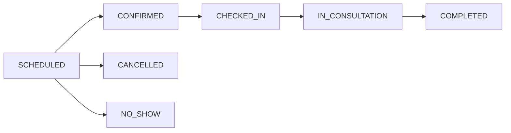
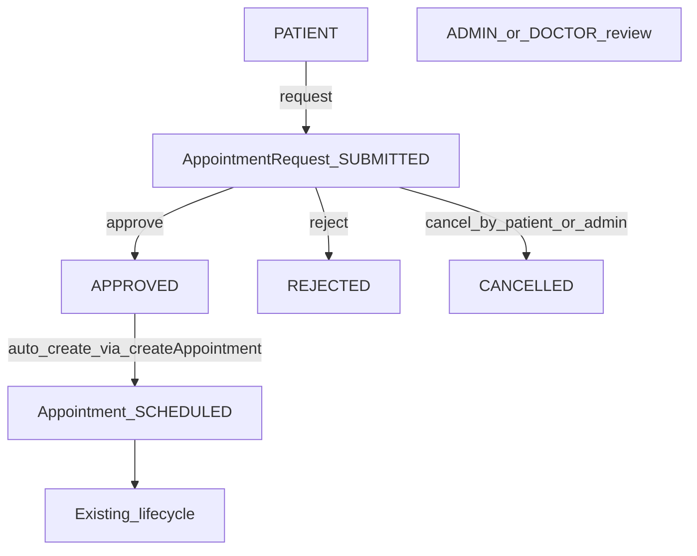

# PHASE B — Appointment Request + Staff Approval (Implementation Plan)

**Status:** PLAN / INSPECTION ONLY — do not implement until explicit approval.

**Roadmap note:** [`docs/NEXT_PRODUCT_FEATURES.md`](docs/NEXT_PRODUCT_FEATURES.md) is still a drafting outline; Phase B is priority #2 / PHASE B. Feature 2 sketch mentions SUPPORT/ADMIN approval. **Conflict:** SUPPORT has **no** route authorization today. This plan proposes **ADMIN + DOCTOR** as reviewers (aligned with existing appointment view/status RBAC), not SUPPORT, unless you later explicitly activate SUPPORT.

---

## 1. Current-state findings

### Appointment (EXISTING)

| Area | Finding |
|------|---------|
| Model | [`Appointment`](backend/prisma/schema.prisma) — `appointmentNo`, patientId, doctorId, appointmentAt, duration, type, status, reason, notes |
| Status enum | `SCHEDULED` → `CONFIRMED` → `CHECKED_IN` → `IN_CONSULTATION` → `COMPLETED`; also `CANCELLED`, `NO_SHOW` |
| Transitions | Enforced in [`appointment.service.ts`](backend/src/services/appointment.service.ts) (`ALLOWED_TRANSITIONS` + `ROLE_TARGET_STATUSES`) |
| Create | **ADMIN only** — `POST /api/appointments` |
| Update details | **ADMIN only** — `PUT /api/appointments/:id` (SCHEDULED/CONFIRMED only) |
| Status patch | **ADMIN, DOCTOR** |
| Cancel | **ADMIN only** — `DELETE` → SCHEDULED→CANCELLED |
| List/detail | **ADMIN, DOCTOR** — all appointments (not filtered by doctor identity) |
| Patient history | `GET /api/patients/:id/appointments` via `requirePatientAccess` |
| Conflicts | Backend overlap on doctor + patient for active statuses; past time rejected; doctor must be `ACTIVE` |
| Doctor↔User | **No FK** — `Doctor` is separate from `User`; cannot natively scope “own” doctor queue by userId |

### Availability (EXISTING — not authoritative)

- UI-only slots in [`Doctors.tsx`](frontend/src/pages/Doctors.tsx) stored in **localStorage**
- **Not** in Prisma; **not** checked by `createAppointment`
- Backend remains the only authority (overlap + ACTIVE doctor)

### Patient portal (EXISTING)

- [`MyAppointments.tsx`](frontend/src/pages/MyAppointments.tsx): view-only — copy says **“Booking is not available.”**
- Also: profile, prescriptions (Phase A), orders
- Nav: Dashboard, My Profile, My Appointments, My Prescriptions, My Orders

### Staff UI (EXISTING)

- ADMIN: `/appointments`, `/appointments/new`, details
- DOCTOR: list + details + status; **no** create
- PHARMACIST / SUPPORT / VIEWER: no appointment routes

### Missing for Phase B

- No request entity, no patient booking API, no staff approval queue, no PATIENT access to doctor directory (`GET /api/doctors` is ADMIN/DOCTOR only)

---

## 2. Existing appointment architecture (must preserve)



Admin direct create remains: `POST /api/appointments` → starts at **SCHEDULED**. Do **not** add REQUESTED/APPROVED to `AppointmentStatus`.

---

## 3. Proposed business workflow



**Request statuses (NEW / PROPOSED):** `SUBMITTED` | `APPROVED` | `REJECTED` | `CANCELLED`  
**Appointment statuses:** unchanged EXISTING machine after create.

---

## 4. Request vs Appointment state model

| Layer | Statuses | Mutated by |
|-------|----------|------------|
| **NEW** `AppointmentRequest` | SUBMITTED → APPROVED / REJECTED / CANCELLED | New refill-like service |
| **EXISTING** `Appointment` | SCHEDULED → … | Existing appointment APIs only |

Link: `AppointmentRequest.appointmentId` set on approve (unique). Approval does **not** invent appointment statuses.

---

## 5. Answers to key business questions (**PROPOSED** where new)

| # | Question | Answer |
|---|----------|--------|
| 1 | Who can request? | **PATIENT** (own linked patient only). Not PHARMACIST/DOCTOR/VIEWER/SUPPORT. |
| 2 | ADMIN direct create? | **Yes — unchanged** (`POST /api/appointments`). |
| 3 | DOCTOR create appointments? | **No — unchanged**. |
| 4 | Who approves? | **ADMIN** (any), **DOCTOR** (any) — matches today’s global appointment visibility; no User↔Doctor FK. |
| 5 | Doctor approve “own” only? | **Not enforceable** without new identity link → PROPOSED: any DOCTOR may approve any request (same as listing all appointments). |
| 6 | Admin approve any? | **Yes**. |
| 7 | Patient cancel pending? | **Yes**, only while `SUBMITTED`. |
| 8 | Doctor reject? | **Yes** (and ADMIN). |
| 9 | Rejection reason required? | **Yes** (min length, like Phase A refill). |
| 10–12 | After approval? | **Auto-create Appointment** by calling existing `createAppointment` in the same flow → status `SCHEDULED`, link `appointmentId`, mark request `APPROVED`. No separate “allow create” step (unlike Phase A orders/prices). |
| 13–15 | Double booking / slot taken | On approve, reuse backend overlap checks. If conflict → approve **fails**, request stays `SUBMITTED` for reject/resubmit guidance. Soft-check overlaps at submit (optional warn/reject duplicate window). **Do not** trust localStorage availability. |
| 16 | Multiple pending requests? | **Yes**, different slots/doctors allowed; block exact duplicate open request (same patientId + doctorId + appointmentAt) while `SUBMITTED`. |
| 17 | After rejection? | New request allowed. |
| 18 | Cancel after approval? | **No** on request (terminal APPROVED). Cancel the **Appointment** via existing ADMIN cancel if needed. |
| 19 | vs appointment cancel rules | Unchanged; request workflow ends at APPROVED/REJECTED/CANCELLED. |

**SUPPORT:** no Phase B access (roadmap sketch conflict noted above).

---

## 6. Proposed data model (**PROPOSED**)

**Model:** `AppointmentRequest` (separate from `Appointment`)

```text
id, requestNo (unique, e.g. AR-{timestamp})
patientId → Patient
doctorId → Doctor
requestedAt DateTime          // preferred start
duration Int @default(30)
type AppointmentType @default(IN_PERSON)
reason String
notes String?
status AppointmentRequestStatus  // SUBMITTED|APPROVED|REJECTED|CANCELLED
requestedByUserId → User
reviewedByUserId Int?
rejectionReason String?
reviewedAt DateTime?
appointmentId Int? @unique → Appointment
createdAt, updatedAt
@@index([patientId], [doctorId], [status], [requestedAt])
@@index([patientId, doctorId, requestedAt, status])  // duplicate checks in service
```

Additive relations on Patient, Doctor, User, Appointment. **No** change to `AppointmentStatus` enum.

---

## 7. Proposed APIs (**PROPOSED**)

Reuse: `createAppointment` service; patient appointment history GET; appointment lifecycle APIs unchanged.

| Method | Path | Roles | Purpose |
|--------|------|-------|---------|
| POST | `/api/appointment-requests` | PATIENT* | Create request (doctorId, requestedAt, duration?, type?, reason, notes?) |
| GET | `/api/appointment-requests` | ADMIN, DOCTOR; PATIENT* own | List/filter status, doctorId, patientId |
| GET | `/api/appointment-requests/:id` | Same + ownership | Detail |
| PATCH | `/api/appointment-requests/:id/status` | Per matrix | APPROVED / REJECTED / CANCELLED |

**Additive (required for patient UX):** allow PATIENT on `GET /api/doctors` and `GET /api/doctors/:id` **read-only**, ideally filtering list to `status=ACTIVE` for PATIENT (staff keep full list). Do not grant PATIENT doctor write APIs.

Mount like Phase A refill router in [`server.ts`](backend/src/server.ts).

---

## 8. Proposed RBAC matrix (**PROPOSED**)

| Action | ADMIN | DOCTOR | PATIENT | PHARMACIST | SUPPORT/VIEWER |
|--------|-------|--------|---------|------------|----------------|
| Request appointment | No (use direct create) | No | Yes (own) | No | No |
| View requests | All | All | Own | No | No |
| Approve | Yes | Yes | No | No | No |
| Reject | Yes | Yes | No | No | No |
| Cancel SUBMITTED | Yes | No | Own | No | No |
| Create appointment directly | **Existing Yes** | **Existing No** | No | No | No |
| Read doctors (for picker) | Existing | Existing | **Yes (ACTIVE)** additive | No | No |

---

## 9. Availability / conflict strategy

| Layer | Behavior |
|-------|----------|
| Submit | Validate future time; doctor ACTIVE; patient ACTIVE; optional overlap vs existing **Appointments**; reject exact duplicate SUBMITTED request |
| Approve | Transaction: re-validate → call **existing** `createAppointment` (overlap + past + doctor ACTIVE) → set `appointmentId` + APPROVED. Concurrent second approve fails on conflict |
| localStorage slots | UI hint only if reused; **never** security/availability authority |
| Pending request vs pending request | Two SUBMITTED same slot allowed until one approved; second approve fails |

---

## 10. Patient workflow (**PROPOSED UI**)

My Appointments → **Request appointment** → pick ACTIVE doctor / datetime / type / reason → submit → see pending/rejected/approved requests → on APPROVED, appointment appears via existing `GET .../appointments` (and optionally show linked appointmentNo on request row).

---

## 11. Staff workflow (**PROPOSED UI**)

New **Appointment Requests** page (ADMIN + DOCTOR), nav beside Appointments:

Pending queue → open detail → Approve (creates SCHEDULED appointment) / Reject (reason required).

ADMIN **New Appointment** page remains for walk-in/direct scheduling.

---

## 12. Edge cases

- Invalid/inactive doctor or patient → 400/403  
- Past `requestedAt` → 400  
- Overlap on approve → 409/400, request stays SUBMITTED  
- Duplicate open same patient+doctor+time → 409  
- Terminal request status change → 400  
- Concurrent double approve → one wins  
- Unauthorized / other patient’s request → 403  
- Doctor becomes INACTIVE while pending → approve fails (createAppointment rule)  
- Patient INACTIVE → block submit/approve  
- Cancel after APPROVED → forbidden on request API  

---

## 13. Files to change / create (when implementing)

### Backend — create
- `backend/src/services/appointment-request.service.ts`
- `backend/src/controllers/appointment-request.controller.ts`
- `backend/src/routes/appointment-request.routes.ts`
- `backend/src/validators/appointment-request.validator.ts`
- Prisma migration for `AppointmentRequest` + enum

### Backend — modify
- [`backend/prisma/schema.prisma`](backend/prisma/schema.prisma) — additive only  
- [`backend/src/server.ts`](backend/src/server.ts) — mount `/api/appointment-requests`  
- [`backend/src/routes/doctor.routes.ts`](backend/src/routes/doctor.routes.ts) — PATIENT read  
- Docs: `API_INVENTORY.md`, `openapi.yaml`, testing guide  

### Frontend — create
- `frontend/src/pages/RequestAppointment.tsx` (patient)  
- `frontend/src/pages/AppointmentRequestReview.tsx` (admin/doctor)  

### Frontend — modify
- [`MyAppointments.tsx`](frontend/src/pages/MyAppointments.tsx) — request CTA + request list  
- [`App.tsx`](frontend/src/App.tsx), [`AppHeader.tsx`](frontend/src/components/AppHeader.tsx), [`Dashboard.tsx`](frontend/src/pages/Dashboard.tsx)  

**Do not change:** appointment status machine, `NewAppointment.tsx` admin create contract (unless minor shared helpers).

---

## 14. Step-by-step implementation order

| Step | Purpose | Files | Depends | Risk | Verify |
|------|---------|-------|---------|------|--------|
| **B1** Schema | `AppointmentRequest` + enum | schema, migration | — | Medium | migrate/generate |
| **B2** Service | Create/list/status + approve→`createAppointment` | appointment-request.service | B1 | High (txn/conflict) | Conflict + happy approve |
| **B3** Validators/routes | Zod + RBAC mount | validator, controller, routes, server | B2 | Medium | Role matrix |
| **B4** Doctor read for PATIENT | Picker data | doctor.routes (+ filter) | — | Low | PATIENT list ACTIVE only |
| **B5** Patient UI | Request + status | RequestAppointment, MyAppointments, App, Header | B3–B4 | Medium | Smoke 1–2 |
| **B6** Staff UI | Review queue | AppointmentRequestReview, nav, Dashboard | B3 | Medium | Approve/reject |
| **B7** Docs + verification | Inventory/OpenAPI/tests | docs | B3–B6 | Low | Checklist |

Do **not** combine with Phase C–G. Pattern may mirror Phase A refill services but stay appointment-domain separate.

---

## 15. Verification strategy

**Smoke 1:** PATIENT request → DOCTOR/ADMIN approve → Appointment `SCHEDULED` linked → appears on My Appointments → staff can CONFIRMED→… via existing lifecycle.

**Smoke 2:** PATIENT request → reject with reason → patient sees REJECTED + reason; no appointment row.

**Negatives:** unauthenticated; other patient; PHARMACIST 403; past time; inactive doctor; duplicate SUBMITTED; approve with occupied slot; reject without reason; cancel non-SUBMITTED; PATIENT cannot POST `/api/appointments`.

**Regression:** ADMIN New Appointment; DOCTOR status transitions; cancel SCHEDULED; overlap errors; patient history GET; Phase A refill flows untouched.

---

## 16. Risks

- Roadmap SUPPORT vs real ADMIN/DOCTOR review  
- No User↔Doctor link → cannot restrict “own doctor” queue without new schema (out of Phase B unless approved)  
- Auto-create on approve needs careful transaction (avoid APPROVED without appointment)  
- localStorage availability may confuse UI if shown as real — label as optional hint only  
- PATIENT doctor directory expands read surface — keep ACTIVE-only and no writes  

---

## 17. Backward compatibility

Must remain unchanged:

- AppointmentStatus machine and transition/role rules  
- ADMIN create/update/cancel appointment APIs  
- DOCTOR view + status patch  
- Patient appointment history GET  
- Overlap/conflict semantics in `createAppointment`  
- Existing appointment list/detail/new pages behavior  
- Auth/JWT; no SUPPORT/VIEWER invention  

Feature is **additive**: new table, new `/api/appointment-requests`, patient booking UI, staff review UI.

---

## Decisions locked for approval

1. Separate `AppointmentRequest` entity — **no** AppointmentStatus changes  
2. Approve **auto-creates** Appointment via existing `createAppointment` → `SCHEDULED`  
3. Reviewers: **ADMIN + DOCTOR** (not SUPPORT/PHARMACIST)  
4. Requesters: **PATIENT** only  
5. ADMIN direct booking preserved  
6. Backend conflict checks authoritative; localStorage not authoritative  
7. Additive PATIENT read of ACTIVE doctors for picker  

**Awaiting explicit approval before any implementation.**
