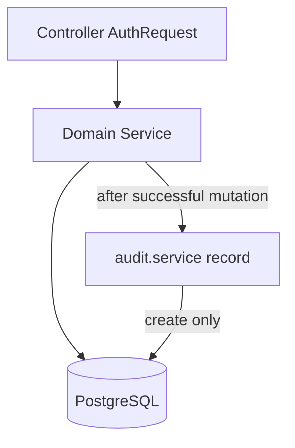

# PHASE E — Clinical / Operational Audit Trail (Implementation Plan)

**Status:** PLAN / INSPECTION ONLY — do not implement until explicit approval.

**Roadmap:** [`docs/NEXT_PRODUCT_FEATURES.md`](docs/NEXT_PRODUCT_FEATURES.md) Feature 5 / PHASE E — append-only `AuditEvent`, progressive hooks, VIEWER/SUPPORT read; independently implementable.

**Default decision (stated, not optional):** Read access = **ADMIN + VIEWER + SUPPORT**. Roadmap names VIEWER/SUPPORT; ADMIN is included because it already owns ops/security and is the only role that can create VIEWER/SUPPORT users today. DOCTOR / PATIENT / PHARMACIST have **no** audit read access in v1.

---

## 1. Current-state findings (EXISTING)

### No audit capability today
- Prisma schema has **no** `AuditEvent` / `AuditLog` model ([`backend/prisma/schema.prisma`](backend/prisma/schema.prisma)).
- [`docs/openapi.yaml`](docs/openapi.yaml) and [`docs/API_INVENTORY.md`](docs/API_INVENTORY.md) have **no** audit endpoints.
- Mutations are not immutably recorded.

### How identity is known today

| Concept | Source today |
|---------|----------------|
| **User** | JWT → `req.user.userId` ([`backend/src/middleware/auth.ts`](backend/src/middleware/auth.ts)) |
| **Role** | JWT → `req.user.role` (string; compared via `authorize(...)`) |
| **Email** | JWT → `req.user.email` (not needed for audit core) |
| **Entity / entity ID** | Per-resource IDs returned by services (`appointment.id`, `patient.id`, etc.) — no shared entity vocabulary |
| **Action** | Implied by HTTP method / service method name — no shared action enum |
| **Timestamp** | `createdAt` / `updatedAt` on domain rows only; not an audit clock |
| **IP address** | **Not captured** anywhere in middleware/controllers |
| **Correlation / request ID** | **Not present** |

### RBAC reality
- Roles in schema: `ADMIN`, `DOCTOR`, `PHARMACIST`, `PATIENT`, `SUPPORT`, `VIEWER`.
- **SUPPORT and VIEWER are authorized on zero routes today** (inventory confirms; grep of `authorize(...)` confirms). Frontend has **no** SUPPORT/VIEWER nav or routes ([`frontend/src/App.tsx`](frontend/src/App.tsx), [`AppHeader.tsx`](frontend/src/components/AppHeader.tsx)).
- Phase E is the first planned feature that deliberately activates VIEWER/SUPPORT (read-only audit).

### Architecture patterns relevant to audit
- Controllers → services → Prisma; business rules live in **services**.
- Nested writes already exist: [`appointment-request.service.ts`](backend/src/services/appointment-request.service.ts) calls `appointmentService.createAppointment` on approve; [`refill-request.service.ts`](backend/src/services/refill-request.service.ts) calls `orderService.createOrder` on fulfill. **Controller-only hooks would miss nested creates.**
- Newer request workflows pass `actorUserId` + `role` into services; older modules (patient, appointment, prescription, order) often do **not** receive actor in the service signature.
- List APIs generally return full `findMany` results; refill/appointment-request lists use **query filters** but **no offset/limit pagination**.
- Frontend pages typically `fetch` with `Authorization: Bearer`; axios helper exists at [`frontend/src/services/api.ts`](frontend/src/services/api.ts).
- Auth security mutations already update `AccountSecurity` / reset tokens, but there is no immutable security event log.

### High-value mutation surface (EXISTING)

| Domain | Key mutations (services) |
|--------|---------------------------|
| Patient | `createPatient`, `updatePatient`, `deactivatePatient`, `deletePatient` |
| Appointment | `createAppointment`, `updateAppointment`, `updateAppointmentStatus`, `cancelAppointment` |
| AppointmentRequest | `createAppointmentRequest`, `updateAppointmentRequestStatus` |
| Prescription | `createPrescription`, `updatePrescriptionStatus`, `deletePrescription` |
| RefillRequest | `createRefillRequest`, `updateRefillRequestStatus`, `createOrderFromRefillRequest` |
| Order | `createOrder`, `updateOrderStatus`, `updatePaymentStatus`, `deleteOrder` |
| Auth | `loginUser`, `changePassword`, lockout path inside login (optional for v1) |

---

## 2. Recommended audit scope

### MUST HAVE (v1 — minimum useful)

1. **Appointment lifecycle:** create, update details, status change, cancel  
2. **Appointment request decisions:** create, approve, reject, cancel  
3. **Prescription:** create, status change, delete  
4. **Refill/renewal:** create, approve/reject/cancel, fulfill (order link)  
5. **Order / payment:** create, order status, payment status  
6. **Patient core:** create, update, deactivate (not hard-delete as primary; see below)  
7. **Read API + staff UI** for ADMIN / VIEWER / SUPPORT  

### OPTIONAL / FUTURE (explicitly out of v1)

- Auth events (LOGIN success/failure, LOCKOUT, password change/reset) — useful but needs careful failure-path design and no password/token leakage  
- Patient dependents / emergency contact / medical profile / documents  
- Doctor registry CRUD  
- User admin CRUD  
- Hard `deletePatient` / `deleteOrder` (can add later; deactivate + status changes cover most ops value)  
- IP / correlation ID (not available cleanly today — do not invent middleware solely for audit v1)  
- Role-scoped audit views (e.g. doctor sees only own patients’ events)  
- Analytics dashboards, export, retention/purge jobs, DB triggers / row-level immutability grants  
- Pagination beyond simple `limit`/`offset` if lists stay small; can add later  

**Minimum useful initial scope:** items 1–7 above. That covers the richest clinical/ops workflows already in the app without instrumenting every table.

---

## 3. Proposed AuditEvent model (PROPOSED)

New Prisma model `AuditEvent` (append-only). No FK cascade from domain tables (audit must survive entity deletes).

| Field | Type | Why required |
|-------|------|----------------|
| `id` | `Int` @id autoincrement | Stable event identity |
| `occurredAt` | `DateTime` @default(now()) | Event time (indexed; primary sort) |
| `actorUserId` | `Int?` | Who performed the action; nullable for rare system/unauthenticated future cases (v1 mutations are authenticated → always set) |
| `actorRole` | `String` | Role at time of action (JWT role snapshot; roles can change later) |
| `action` | `String` | Vocabulary value (CREATE, STATUS_CHANGE, …) |
| `entityType` | `String` | Domain type (APPOINTMENT, ORDER, …) |
| `entityId` | `Int` | Primary key of the entity |
| `metadata` | `Json?` | Small safe details (before/after status, requestNo, etc.) — never secrets |

**Explicitly omitted in v1:** `ipAddress`, `requestId`, `actorEmail`, `patientId` denormalized column, `success` boolean (only successful ops are audited).

**Indexes (PROPOSED):** `@@index([occurredAt])`, `@@index([entityType, entityId])`, `@@index([actorUserId])`, `@@index([action])`.

**Actor relation (PROPOSED):** optional `User` relation on `actorUserId` with `onDelete: SetNull` so deleting a user does not delete audit rows; keep `actorRole` string regardless.

---

## 4. Action vocabulary (PROPOSED — small set)

Use a **fixed string set** (TypeScript const union), not a Prisma enum (avoids migration churn when extending).

| Action | Use when |
|--------|----------|
| `CREATE` | New domain row created |
| `UPDATE` | Non-status field update (patient demographics, appointment reschedule/details) |
| `STATUS_CHANGE` | Status/paymentStatus transitions (include `from`/`to` in metadata) |
| `APPROVE` | Request approved (appointment request / refill) |
| `REJECT` | Request rejected |
| `CANCEL` | Explicit cancel paths (appointment cancel, request cancel) |
| `DELETE` | Hard delete (prescription delete if hooked; future deletes) |

**Do not invent** `LOGIN` / `LOGOUT` / `PAYMENT` in v1 — payment uses `STATUS_CHANGE` on `Order` with metadata `{ field: "paymentStatus", from, to }`.

### Entity type vocabulary

`PATIENT` | `APPOINTMENT` | `APPOINTMENT_REQUEST` | `PRESCRIPTION` | `REFILL_REQUEST` | `ORDER`

---

## 5. RBAC / access model (PROPOSED)

| Role | Write audit (via hooks) | Read audit API/UI |
|------|-------------------------|-------------------|
| ADMIN | N/A (system writes) | **Yes — full list** |
| VIEWER | No | **Yes — full list** (roadmap) |
| SUPPORT | No | **Yes — full list** (roadmap) |
| DOCTOR | No direct API | **No** (v1) |
| PHARMACIST | No | **No** (v1) |
| PATIENT | No | **No** (privacy) |

**Visibility (v1):** all authorized readers see the **same global operational trail**. Do not expose raw medical notes, diagnosis text, allergies, or payment credentials in `metadata`. Safe metadata examples: status from/to, `appointmentNo` / `orderNo` / `requestNo` / `prescriptionNo`, related IDs.

**Immutability via API:** **no** PUT/PATCH/DELETE audit endpoints. Prisma service exposes only `createAuditEvent` + `listAuditEvents` (no update/delete helpers).

---

## 6. API design (PROPOSED)

**New endpoint required** — nothing existing can list audit events.

```
GET /api/audit-events
```

| Concern | Design |
|---------|--------|
| Auth | `authenticate` + `authorize("ADMIN", "VIEWER", "SUPPORT")` |
| Filters (query) | `actorUserId`, `action`, `entityType`, `entityId`, `from` (ISO date), `to` (ISO date) |
| Pagination | `limit` (default 50, max 100), `offset` (default 0) — introduce here because audit grows unboundedly; other list APIs stay unchanged |
| Sort | `occurredAt` desc only |
| Response | `{ success: true, data: AuditEvent[], meta: { limit, offset, total } }` |
| Write APIs | **None** |

No `GET /:id` required in v1 (list + filters suffice).

Mount in [`backend/src/server.ts`](backend/src/server.ts): `app.use("/api/audit-events", auditEventRoutes)`.

Update docs after implementation: [`docs/API_INVENTORY.md`](docs/API_INVENTORY.md), [`docs/openapi.yaml`](docs/openapi.yaml), brief note in [`docs/API_TESTING_GUIDE.md`](docs/API_TESTING_GUIDE.md).

---

## 7. UI approach (PROPOSED)

Minimum useful staff page — not a dashboard.

- **Route:** `/audit-logs`
- **Access:** `ProtectedRoute allowedRoles={["ADMIN","VIEWER","SUPPORT"]}`
- **Nav:** AppHeader entry for those roles; Dashboard card for ADMIN (and VIEWER/SUPPORT once they can reach dashboard)
- **Page:** table columns — occurredAt, actorUserId (and name if joined), actorRole, action, entityType, entityId, compact metadata JSON/text
- **Controls:** filters matching API; Prev/Next or offset-based pagination
- **Reuse patterns from:** [`RefillRequestReview.tsx`](frontend/src/pages/RefillRequestReview.tsx) (filter + table) and existing AppLayout/header styles — no new design system

VIEWER/SUPPORT today only get Dashboard via unscoped `ProtectedRoute`; Audit Logs becomes their first real operational page.

---

## 8. Audit logging architecture (PROPOSED)



**Chosen approach: Dedicated audit service + service-level hooks (B + D).**

| Option | Verdict |
|--------|---------|
| A. Controller-only | Reject — misses nested `createAppointment` / `createOrder` from request services |
| B. Service-level hooks | **Adopt** — single place business success is known |
| C. Middleware | Reject — cannot know entity IDs/outcomes reliably |
| D. Dedicated `audit.service` | **Adopt** — one write API, consistent shape |
| E. DB triggers | Reject — over-engineered; hard to attach actor/role |

### Actor plumbing
For older services lacking actor params, **extend mutation signatures** with optional `auditContext?: { actorUserId: number; actorRole: string }` (or required where always authenticated). Controllers pass `req.user`. Nested callers pass their existing `actorUserId`/`role`.

### Failure policy (chosen)
**Audit write failure must NOT fail the business operation.**  
After successful domain write: `try { await recordAudit(...) } catch { console.error(...) }`.  
Rationale: availability of care workflows > perfect audit; silent business rollback on audit DB blips is worse clinically. Log errors for ops follow-up.

Do **not** wrap domain + audit in one transaction for v1 (avoids coupling; accept rare missing events).

---

## 9. Progressive hook strategy (v1 order)

Instrument in this order (highest ops value / nested-call safety first):

1. **Foundation:** schema + `audit.service` + GET API + UI (can verify with a manual service smoke before all hooks)  
2. **Appointments + appointment requests** (includes nested create on approve)  
3. **Prescriptions + refill requests** (includes nested order create on fulfill)  
4. **Orders** (status + payment; create already covered when nested — still hook direct `createOrder`)  
5. **Patients** (create / update / deactivate)

Within each service, call `recordAudit` only on **successful** paths, once per logical business event (approve request → `APPROVE` on `APPOINTMENT_REQUEST`; nested appointment create → separate `CREATE` on `APPOINTMENT`).

---

## 10. Security / privacy considerations

**Never store in metadata:** passwords, password hashes, JWT/reset tokens, full request bodies, payment card data (none exist today — keep it that way), medical profile free text, diagnosis/notes/reason blobs, document file contents.

**Safe metadata examples:**
- `{ from: "SCHEDULED", to: "CONFIRMED" }`
- `{ field: "paymentStatus", from: "PENDING", to: "PAID" }`
- `{ appointmentNo: "APT-…", requestNo: "…" }`
- `{ patientId: 12 }` when entity is not Patient

**API:** read-only; authorize tightly; no public access.  
**Privacy:** patients cannot read the global trail.  
**Immutability:** no update/delete service methods or routes; rely on application-layer enforcement (sufficient for v1; DB REVOKE optional/future).

---

## 11. Exact files to change / create

### New (PROPOSED)
- Migration under `backend/prisma/migrations/..._add_audit_events/`
- [`backend/src/services/audit.service.ts`](backend/src/services/audit.service.ts) — `recordAuditEvent`, `listAuditEvents`
- [`backend/src/controllers/audit.controller.ts`](backend/src/controllers/audit.controller.ts)
- [`backend/src/routes/audit.routes.ts`](backend/src/routes/audit.routes.ts)
- [`backend/src/validators/audit.validator.ts`](backend/src/validators/audit.validator.ts) — query params
- [`frontend/src/pages/AuditLogs.tsx`](frontend/src/pages/AuditLogs.tsx)

### Modify (PROPOSED)
- [`backend/prisma/schema.prisma`](backend/prisma/schema.prisma) — `AuditEvent` (+ optional User back-relation)
- Domain services listed in §9 — post-success `recordAuditEvent` calls + `auditContext` params
- Matching controllers — pass `req.user` into services where needed
- [`backend/src/server.ts`](backend/src/server.ts) — mount routes
- [`frontend/src/App.tsx`](frontend/src/App.tsx) — route
- [`frontend/src/components/AppHeader.tsx`](frontend/src/components/AppHeader.tsx) — nav
- [`frontend/src/pages/Dashboard.tsx`](frontend/src/pages/Dashboard.tsx) — card for authorized roles
- Docs: `API_INVENTORY.md`, `openapi.yaml`, `API_TESTING_GUIDE.md` (additive)

### Do not change
- Appointment/prescription/order business rules, status machines, RBAC of existing endpoints (except new audit authorize list)
- Existing API contracts/response shapes for non-audit routes

---

## 12. Step-by-step implementation order

| Step | Work | Depends on | Risk | Verify |
|------|------|------------|------|--------|
| **E1** | Schema `AuditEvent` + migration + Prisma generate | Approval | Migration on shared DB | `migrate` / client generates |
| **E2** | `audit.service` (create + list with filters/pagination) | E1 | None | Unit-style service call or temporary script |
| **E3** | GET `/api/audit-events` + validator + mount + authorize | E2 | Accidental write routes | 401/403/200; no PUT/DELETE |
| **E4** | Hook appointments + appointment-requests | E2 | Double-count or missed nested create | Approve request → 2 events (APPROVE + CREATE) |
| **E5** | Hook prescriptions + refill-requests | E2 | Metadata leakage | Approve refill / fulfill → events without Rx notes |
| **E6** | Hook orders (+ payment status) | E2 | Duplicate CREATE if fulfill already logged order create once (acceptable: one CREATE from `createOrder`) | Direct order create + status patches |
| **E7** | Hook patients create/update/deactivate | E2 | PII in metadata | Only IDs/status in metadata |
| **E8** | Frontend Audit Logs page + nav/dashboard | E3 | VIEWER/SUPPORT UX gap | Login as VIEWER/SUPPORT/ADMIN |
| **E9** | Docs inventory/OpenAPI/testing guide | E3–E8 | Doc drift | Diff against routes |
| **E10** | Smoke + negative + regression report; **STOP** | All | — | §13–14 |

Keep steps additive; do not refactor unrelated modules.

---

## 13. Smoke verification

**Smoke A — create path**
1. As ADMIN, create an appointment (or approve an appointment request).  
2. As VIEWER (or SUPPORT), open `/audit-logs` / `GET /api/audit-events`.  
3. Confirm event(s): actorUserId, actorRole, action, entityType, entityId, occurredAt.  
4. Confirm no edit/delete controls in UI; `PUT`/`DELETE` `/api/audit-events/:id` → 404 (no route).

**Smoke B — status change**
1. As DOCTOR/ADMIN, `PATCH` appointment status (e.g. SCHEDULED→CONFIRMED).  
2. Confirm `STATUS_CHANGE` event with metadata `{ from, to }`.  
3. Confirm business behavior unchanged (appointment status still updated).

---

## 14. Negative / regression verification

**Negative / API**
- Unauthenticated GET → 401  
- PATIENT / DOCTOR / PHARMACIST GET → 403  
- VIEWER / SUPPORT / ADMIN GET → 200  
- Attempt POST/PUT/PATCH/DELETE audit → not available (404)  
- Filters return consistent subsets  

**Regression (must remain unchanged)**
- Appointment transitions / overlap rules  
- Prescription create/status  
- Order + payment status  
- Refill approve/reject/cancel/fulfill  
- Appointment request approve→appointment create  
- Existing role authorizations on non-audit routes  
- Patient portal flows  

**Checks:** backend `tsc`/dev start; frontend build; manual workflow above. State any skipped check explicitly.

---

## 15. Risks

| Risk | Mitigation |
|------|------------|
| Nested service calls produce multiple events | Intended; document as separate entity events |
| Actor missing on older services | Pass `auditContext` from controllers |
| Audit DB failure | Swallow + `console.error`; business succeeds |
| Metadata PII creep | Allowlist fields only in each hook |
| VIEWER/SUPPORT unused until now | First real routes; keep read-only |
| List unbounded growth | `limit`/`offset` + indexes from day one |
| Accidentally changing business logic while hooking | Touch only post-success paths; no rule edits |

---

## 16. Backward compatibility

Audit is **additive only**:
- No changes to existing endpoint contracts  
- No changes to appointment/prescription/order/refill/request state machines  
- No RBAC changes except **new** audit read authorize list  
- No schema changes to existing tables beyond optional `User.auditEvents` back-relation  
- Existing UIs keep working; new page is additive  

---

## Labels summary

| Item | Label |
|------|--------|
| No AuditLog today; SUPPORT/VIEWER unused on routes | **EXISTING** |
| `AuditEvent` model, GET API, UI, service hooks, ADMIN+VIEWER+SUPPORT read | **PROPOSED** |
| Auth events, IP/correlation, DB triggers, doctor-scoped views, hard-delete hooks, dependents/docs | **OPTIONAL/FUTURE** |

---

## Completion gate (after future implementation — not now)

Report files/API/schema impact; confirm existing workflows unchanged; **STOP** for further approval.

---

### Plan-phase confirmations (this turn)

- Inspection completed  
- Plan created  
- No application code changed  
- No API behavior changed  
- No database/schema changed  
- No migrations changed  

**STOP — wait for explicit approval before implementation.**
