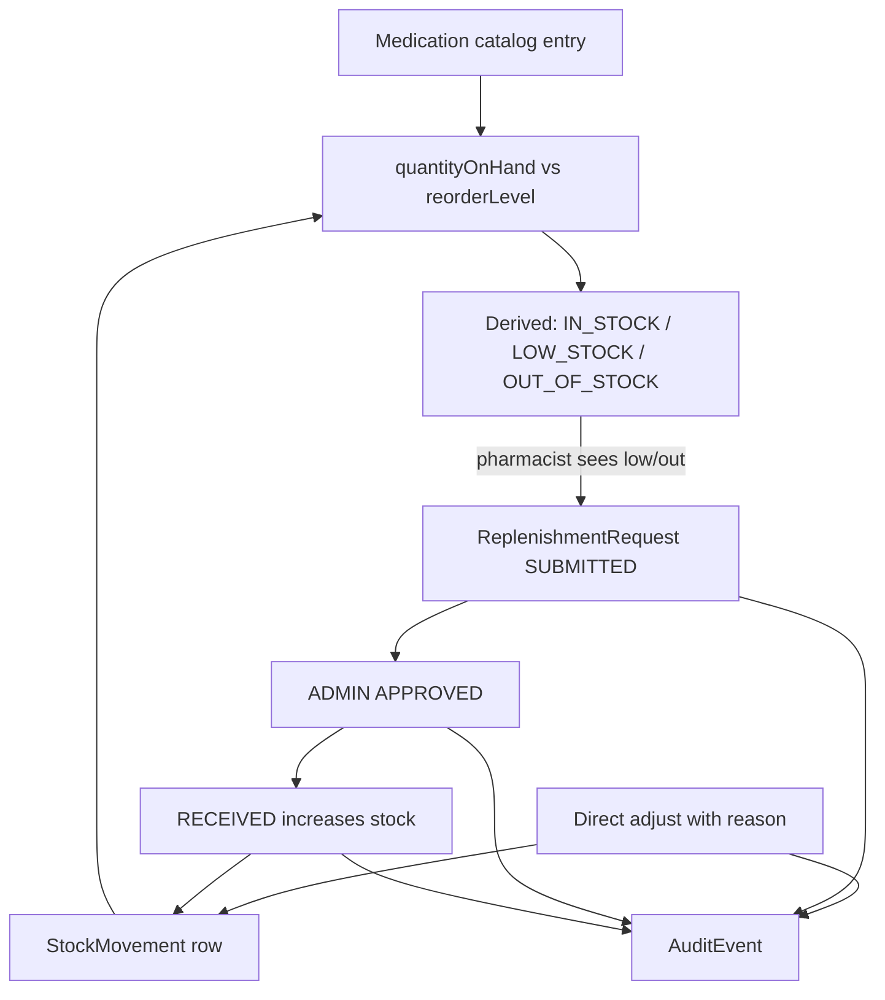

# PHASE F — Pharmacy Medication Inventory & Replenishment (Implementation Plan)

**Status:** PLAN / INSPECTION ONLY — do not implement until explicit approval.

**Roadmap:** [`docs/NEXT_PRODUCT_FEATURES.md`](docs/NEXT_PRODUCT_FEATURES.md) Feature 6 / PHASE F — *MedicationCatalog + stock levels + replenishment requests; soft link to orders later.*

**Critical inspection correction:** Despite the prompt’s “we already have Products,” the repository has **no Product / Inventory / Catalog models and no inventory APIs**. Orders use free-text `OrderItem.productName` only. This plan does **not** invent a pre-existing catalog.

---

## 1. Current-state findings (EXISTING)

### Database ([`backend/prisma/schema.prisma`](backend/prisma/schema.prisma))

| Area | Finding |
|------|---------|
| Product / MedicationCatalog | **Missing** |
| Inventory / stock / reorder | **Missing** |
| StockMovement / InventoryTransaction | **Missing** |
| `Order` | Status + paymentStatus lifecycle; no FK to catalog |
| `OrderItem` | `productName` (String), `quantity`, `unitPrice`, `totalPrice` — free text |
| `PrescriptionItem` | `medicineName` free text — unrelated to stock |
| Pharmacy relations | None beyond pharmacist role using order/Rx APIs |
| `AuditEvent` (Phase E) | Append-only; entity types today exclude medication/inventory |

### Backend / APIs ([`docs/API_INVENTORY.md`](docs/API_INVENTORY.md))

- **No** `/api/products`, `/api/inventory`, `/api/medications`, or replenishment endpoints.
- Orders: create / status / payment-status / delete — **no stock reads or writes** in [`order.service.ts`](backend/src/services/order.service.ts).
- Pharmacy role uses existing Rx + order routes; Pharmacy UI is lookup + status patches only ([`PharmacyWorkspace.tsx`](frontend/src/pages/PharmacyWorkspace.tsx)).

### Frontend

| Surface | Finding |
|---------|---------|
| Pharmacy workspace | Patient/order/Rx lookup; status updates; **no inventory** |
| Order UIs | Free-text product name entry ([`MyOrders.tsx`](frontend/src/pages/MyOrders.tsx), PatientOrders, refill fulfill) |
| Nav | PHARMACIST: Dashboard, Pharmacy, Refills — **no Inventory** |
| Product pages | **Missing** |

### Labels

| Item | Label |
|------|--------|
| Free-text order items; pharmacy fulfillment; refill→order; AuditEvent | **EXISTING** |
| Medication catalog, stock, movements, replenishment requests, inventory UI/API | **PROPOSED** |
| Auto stock deduct on order; OrderItem→Medication FK; purchase/vendor PO system | **OPTIONAL/FUTURE** |

---

## 2. Existing inventory / product behavior

**There is no inventory behavior today.**

**EXISTING ORDER BEHAVIOR (must preserve):**
- Create order with free-text lines → PENDING / payment PENDING
- Pharmacist/admin patch order status and payment status
- Cancel via status or ADMIN delete
- Refill fulfill creates order with free-text items from Rx medicines
- **Stock is never read or modified**

---

## 3. Proposed business workflow (PROPOSED)

Smallest useful pharmacy ops loop (matches roadmap; not a full procurement system):

**Chosen replenishment style:** **B — Replenishment request** (patterned after refill/appointment requests), plus a controlled **direct adjust** for corrections/receiving without a request. **Not** a vendor purchase-order system (C). Direct-only (A) alone is too weak vs roadmap.

---

## 4. Stock model strategy (PROPOSED)

### Model A — `Medication` (catalog + current stock on one row)

Minimum useful fields:

| Field | Purpose |
|-------|---------|
| `id` | PK |
| `sku` | Unique pharmacy code (stable identity; not free-text name alone) |
| `name` | Display name |
| `unit` | e.g. tablet, bottle (string) |
| `quantityOnHand` | Int ≥ 0 |
| `reorderLevel` | Int ≥ 0; low when `0 < qty ≤ reorderLevel` |
| `reorderQuantity` | Suggested default qty for replenishment create |
| `status` | `ACTIVE` / `INACTIVE` (inactive: no adjust/replenish create) |
| `createdAt` / `updatedAt` | Timestamps |

**Why not a separate Inventory table in v1:** one medication ↔ one on-hand quantity; separate Inventory adds join cost without multi-location need.

**Derived stock status (computed in API/UI, not stored enum):**
- `OUT_OF_STOCK` if `quantityOnHand === 0`
- `LOW_STOCK` if `quantityOnHand > 0 && quantityOnHand <= reorderLevel`
- `IN_STOCK` otherwise

### Model B — `StockMovement` (append-only history)

Required in v1 so every change is explainable (adjustment reason, replenishment receive, concurrency debugging).

| Field | Purpose |
|-------|---------|
| `id` | PK |
| `medicationId` | FK |
| `movementType` | `ADJUSTMENT` / `REPLENISHMENT_RECEIVE` (string union; extend later for `ORDER_FULFILL`) |
| `quantityDelta` | Int ≠ 0 (signed) |
| `quantityBefore` / `quantityAfter` | Snapshot |
| `reason` | Required for adjustments; optional note for receive |
| `actorUserId` | Who |
| `replenishmentRequestId` | Nullable FK when from receive |
| `createdAt` | When |

No UPDATE/DELETE APIs for movements.

### Model C — `ReplenishmentRequest`

| Field | Purpose |
|-------|---------|
| `id`, `requestNo` | Identity (`RP-{timestamp}` style like AR/RR) |
| `medicationId` | What to replenish |
| `requestedQuantity` | Int > 0 |
| `status` | `SUBMITTED` / `APPROVED` / `REJECTED` / `CANCELLED` / `RECEIVED` |
| `requestedByUserId`, `reviewedByUserId?`, `reviewedAt?` | Actors |
| `rejectionReason?`, `notes?` | Ops text |
| `receivedQuantity?` | Set on receive (may equal requested) |
| `createdAt` / `updatedAt` | Timestamps |

---

## 5. Replenishment strategy (PROPOSED)

| Status | Who | Effect |
|--------|-----|--------|
| CREATE → SUBMITTED | ADMIN, PHARMACIST | Request only; stock unchanged |
| APPROVE | **ADMIN only** | Stock unchanged |
| REJECT | ADMIN | Requires reason; terminal |
| CANCEL | ADMIN or requester | Only from SUBMITTED |
| RECEIVE | ADMIN, PHARMACIST | From APPROVED only; increases `quantityOnHand` by `receivedQuantity` in one transaction + `StockMovement` |

**Duplicate open requests:** Reject create if same medication already has `SUBMITTED` or `APPROVED` request (**PROPOSED**).

**Direct adjust:** ADMIN/PHARMACIST; body `{ delta, reason }` with `reason` required (min length); result qty must be ≥ 0; writes `StockMovement` type `ADJUSTMENT`.

---

## 6. RBAC (PROPOSED — do not change existing routes)

| Action | ADMIN | PHARMACIST | DOCTOR | PATIENT | SUPPORT | VIEWER |
|--------|-------|------------|--------|---------|---------|--------|
| View inventory / history | Yes | Yes | No | No | No | No |
| Create/update medication (catalog) | Yes | Yes | No | No | No | No |
| Adjust stock | Yes | Yes | No | No | No | No |
| Create replenishment | Yes | Yes | No | No | No | No |
| Approve / reject replenishment | Yes | No | No | No | No | No |
| Receive stock | Yes | Yes | No | No | No | No |

**Answers to business questions (PROPOSED):**

1. View inventory: ADMIN, PHARMACIST  
2. Modify stock: ADMIN, PHARMACIST (adjust + receive)  
3. Create replenishment: ADMIN, PHARMACIST  
4. Approve: ADMIN only  
5. Pharmacist direct adjust: **Yes**, with reason  
6. Reason required on adjust: **Yes**  
7. Low stock: `0 < qty ≤ reorderLevel`  
8. Zero stock: derived `OUT_OF_STOCK`; still listable; block only if business later needs — v1 allows adjust up from 0  
9. Negative stock: **Never**  
10. Increase/decrease: delta adjust or replenishment receive → `StockMovement`  
11. History record every change: **Yes** via `StockMovement`  
12–14. Orders / cancel / refund: **no stock effect in v1** (preserve EXISTING order behavior)  
15. Concurrency: update stock inside a transaction; refuse if expected `quantityOnHand` mismatch on optimistic check, or use `updateMany` with `where: { id, quantityOnHand: before }` and fail if count=0  

---

## 7. Order integration

| Topic | Decision |
|-------|----------|
| EXISTING | Orders never touch stock |
| PROPOSED v1 | **No auto deduct/reserve/restore** on create, process, cancel, refund, or delete |
| OPTIONAL/FUTURE | Soft link: optional `OrderItem.medicationId`; deduct on PROCESSING/SHIPPED; restore on CANCELLED — separate approved phase |

This protects Order → Payment → Pharmacy → Shipment and refill create-order flows.

---

## 8. Audit integration (Phase E)

Reuse [`audit.service.ts`](backend/src/services/audit.service.ts) `safeRecordAuditEvent` — **no second audit system**.

**Extend unions (PROPOSED):**
- `AuditEntityType`: add `MEDICATION`, `REPLENISHMENT_REQUEST`
- `AuditAction`: keep existing set; map:
  - Medication create → `CREATE`
  - Catalog field update → `UPDATE`
  - Stock adjust → `UPDATE` (metadata: `from`, `to`, `delta`, `movementId`)
  - Replenishment create → `CREATE`
  - Approve / Reject / Cancel / Receive → `APPROVE` / `REJECT` / `CANCEL` / `STATUS_CHANGE` (receive: `from: APPROVED`, `to: RECEIVED`)

Safe metadata only (sku, quantities, requestNo) — no secrets.

---

## 9. API design (PROPOSED)

New mount in [`server.ts`](backend/src/server.ts). No duplicates of existing routes.

### Medications / inventory

| Method | Path | Roles | Purpose |
|--------|------|-------|---------|
| GET | `/api/medications` | ADMIN, PHARMACIST | List; filters: `status`, `stockStatus` (`IN_STOCK`/`LOW_STOCK`/`OUT_OF_STOCK`), `q` (name/sku) |
| POST | `/api/medications` | ADMIN, PHARMACIST | Create catalog + initial qty (≥0) |
| GET | `/api/medications/:id` | ADMIN, PHARMACIST | Detail + derived stockStatus |
| PATCH | `/api/medications/:id` | ADMIN, PHARMACIST | Update name/unit/reorder*/status (not qty — qty via adjust/receive) |
| POST | `/api/medications/:id/adjust` | ADMIN, PHARMACIST | `{ delta, reason }` |
| GET | `/api/medications/:id/movements` | ADMIN, PHARMACIST | Stock history (limit/offset) |

### Replenishment

| Method | Path | Roles | Purpose |
|--------|------|-------|---------|
| GET | `/api/replenishment-requests` | ADMIN, PHARMACIST | List; filter `status`, `medicationId` |
| POST | `/api/replenishment-requests` | ADMIN, PHARMACIST | `{ medicationId, requestedQuantity, notes? }` |
| GET | `/api/replenishment-requests/:id` | ADMIN, PHARMACIST | Detail |
| PATCH | `/api/replenishment-requests/:id/status` | role rules in service | `{ status, rejectionReason?, receivedQuantity? }` |

Follow existing `{ success, data }` and Zod validators + `authenticate`/`authorize` patterns from refill-request module.

---

## 10. UI approach (PROPOSED)

Minimum useful UI — reuse `patients-page` / card / table patterns (as Audit Logs / Refill Review).

1. **Inventory page** `/inventory` — ADMIN + PHARMACIST  
   - Table: SKU, Name, Qty, Reorder level, Stock status badge, Actions (Adjust, Request replenishment)  
   - Filters: stock status, ACTIVE/INACTIVE, search  
   - Create medication (simple form)  
   - Adjust modal: delta + reason  
   - Link/drawer: recent movements  

2. **Replenishment queue** `/replenishment-requests` (or section on Inventory)  
   - Status filter; Approve/Reject (ADMIN); Receive (ADMIN/PHARMACIST)  

3. **Nav/Dashboard:** PHARMACIST + ADMIN links; do not remove Pharmacy workspace.

No analytics dashboard.

---

## 11. Edge cases (PROPOSED handling)

| Case | Handling |
|------|----------|
| Negative stock | Reject adjust/receive |
| Zero stock | Allowed; status OUT_OF_STOCK |
| Low threshold | Derived LOW_STOCK |
| Invalid / inactive medication | 404 / 400 on adjust & new replenishment |
| Invalid / zero quantity | 400 |
| Duplicate open replenishment | 409 |
| Unauthorized | 403 via authorize + service rules |
| Concurrent update | Optimistic qty check → 409 |
| Cancelled / failed payment / refunded orders | No stock change (v1) |
| Receive twice | Only APPROVED→RECEIVED once; terminal RECEIVED |
| Invalid replenishment transition | 400 like refill requests |
| Receive qty ≤ 0 | 400 |

---

## 12. Exact files to change / create

### New
- `backend/prisma/migrations/..._add_medication_inventory/`
- [`backend/src/services/medication.service.ts`](backend/src/services/medication.service.ts)
- [`backend/src/services/replenishment-request.service.ts`](backend/src/services/replenishment-request.service.ts)
- Controllers / routes / validators for medications + replenishment-requests
- [`frontend/src/pages/Inventory.tsx`](frontend/src/pages/Inventory.tsx)
- [`frontend/src/pages/ReplenishmentRequests.tsx`](frontend/src/pages/ReplenishmentRequests.tsx) (or combined if kept small)

### Modify
- [`backend/prisma/schema.prisma`](backend/prisma/schema.prisma) — Medication, StockMovement, ReplenishmentRequest + User relations
- [`backend/src/services/audit.service.ts`](backend/src/services/audit.service.ts) — entity type unions (+ validator/OpenAPI audit enums)
- [`backend/src/server.ts`](backend/src/server.ts) — mount routes
- [`frontend/src/App.tsx`](frontend/src/App.tsx), [`AppHeader.tsx`](frontend/src/components/AppHeader.tsx), [`Dashboard.tsx`](frontend/src/pages/Dashboard.tsx)
- Docs: `API_INVENTORY.md`, `openapi.yaml`, `API_TESTING_GUIDE.md`

### Do not change
- Order/prescription/refill business rules or free-text `productName` contracts  
- Existing pharmacy workspace fulfillment behavior  
- Audit immutability model (only extend vocabulary)

---

## 13. Implementation order

| Step | Work | Depends | Risk | Verify |
|------|------|---------|------|--------|
| **F1** | Schema + migration + Prisma generate | Approval | Additive only | migrate succeeds |
| **F2** | Medication CRUD + list filters + derived stockStatus | F1 | Qty rules | create/list/patch |
| **F3** | Adjust + StockMovement + concurrency check | F2 | Race | adjust; reject negative |
| **F4** | Replenishment create/list/status/receive transaction | F3 | Double receive | approve→receive increases qty |
| **F5** | Audit hooks on medication/replenishment | F2–F4 | Metadata leak | GET audit-events |
| **F6** | Inventory + replenishment UI + nav | F4 | Role gating | pharmacist smoke |
| **F7** | Docs | F4–F6 | Drift | inventory vs routes |
| **F8** | Smoke + negative + regression; **STOP** | All | — | §14–15 |

---

## 14. Smoke verification

**Smoke A (primary)**  
1. ADMIN/PHARMACIST creates medication with low `reorderLevel` and small qty → LOW_STOCK  
2. PHARMACIST opens Inventory → sees Low Stock  
3. Creates replenishment → ADMIN approves → PHARMACIST receives  
4. Qty increases; status becomes IN_STOCK (if above reorder)  
5. Movement history shows receive; AuditEvent for CREATE/APPROVE/STATUS_CHANGE/UPDATE exists  

**Smoke B (adjust)**  
1. Pharmacist adjusts +N with reason → qty up; movement ADJUSTMENT; audit UPDATE  
2. Attempt adjust to negative → 400; qty unchanged  

**Order smoke (non-integration):** create/pay/status order still works; stock unchanged.

---

## 15. Regression / negative verification

**Negative:** unauthenticated 401; PATIENT/DOCTOR 403; inactive medication adjust 400; duplicate open replenishment 409; pharmacist approve 403; receive from SUBMITTED 400; double receive 400.

**Regression:** order create/status/payment; pharmacy workspace; refill fulfill; appointment flows; audit read RBAC unchanged for non-inventory entities.

**Checks:** backend migrate + dev; frontend build; state skipped checks explicitly.

---

## 16. Risks

| Risk | Mitigation |
|------|------------|
| Users expect order auto-stock | Document v1 soft-link later; do not silently change orders |
| Free-text orders diverge from catalog | Accepted; OPTIONAL FK later |
| Concurrent oversell | Not applicable until order deduct; still protect adjust races |
| Scope creep to procurement | Stick to replenishment request + adjust |

---

## 17. Backward compatibility

Additive only:
- No change to Order/Payment/Pharmacy/Shipment/Rx/Refill contracts  
- No stock side effects on existing workflows  
- Audit trail extended, not replaced  
- RBAC: only **new** authorize lists for inventory routes  

---

### Plan-phase confirmations (this turn)

- Inspection completed  
- Plan created  
- No application code changed  
- No API behavior changed  
- No database/schema changed  
- No migrations changed  

**STOP — wait for explicit approval before implementation.**
