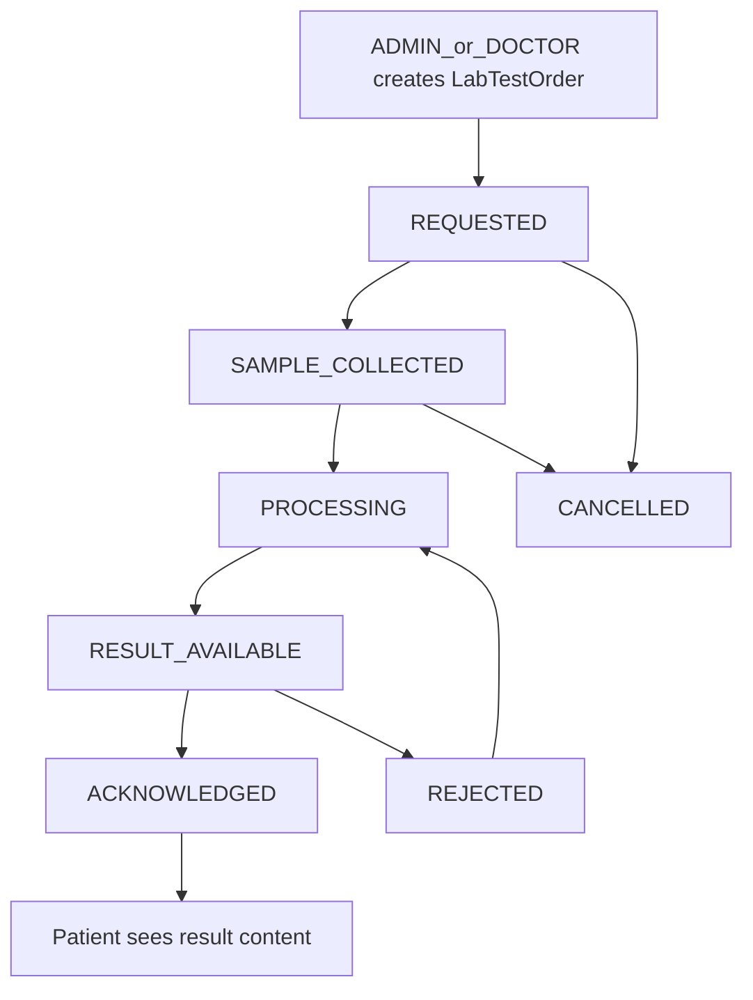

# PHASE G — Lab Test Order & Result Acknowledgment (Implementation Plan)

**Status:** PLAN / INSPECTION ONLY — do not implement until explicit approval.

**Roadmap:** [`docs/NEXT_PRODUCT_FEATURES.md`](docs/NEXT_PRODUCT_FEATURES.md) Feature 7 / PHASE G — *LabOrder + results; optional document attach; doctor acknowledgment.* Complexity **High**, value **High**. This is the last planned roadmap feature.

**Default decisions (locked for this plan):**
- One model: **`LabTestOrder`** (no separate LabTest catalog / LabResult / LabResultValue tables in v1).
- Result payload: **text summary + severity flag + optional file** (Approach C, practical).
- Lab ops role: **ADMIN** (no new LAB_TECH role).
- Patient sees result content **only after `ACKNOWLEDGED`**.
- `Doctor` registry remains unlinked to `User` (EXISTING) — acknowledgment is **role-based** (ADMIN/DOCTOR), not “ordering doctor JWT match.”

---

## 1. Current-state findings (EXISTING)

### Patient / portal
- [`Patient`](backend/prisma/schema.prisma): demographics, status, relations to appointments, documents, Rx, orders, refill/appointment requests — **no lab relation**.
- Staff UI: [`PatientDetails.tsx`](frontend/src/pages/PatientDetails.tsx) (documents, Rx, profile).
- Patient portal: profile, appointments (view + request), prescriptions, orders/payment — **no lab pages** ([`App.tsx`](frontend/src/App.tsx), [`AppHeader.tsx`](frontend/src/components/AppHeader.tsx)).

### Doctor
- [`Doctor`](backend/prisma/schema.prisma): registry with `ACTIVE` / `INACTIVE` / `ON_LEAVE` — **no `User` FK**.
- Prescriptions: `POST /api/prescriptions` ADMIN/DOCTOR; create picks `doctorId` from registry; **does not** require doctor ACTIVE ([`prescription.service.ts`](backend/src/services/prescription.service.ts)).
- Appointments: ADMIN creates; ADMIN/DOCTOR advance status.

### Appointment
- Lifecycle: `SCHEDULED → CONFIRMED → CHECKED_IN → IN_CONSULTATION → COMPLETED` (+ `CANCELLED` / `NO_SHOW`).
- Optional link pattern already used by [`AppointmentRequest.appointmentId`](backend/prisma/schema.prisma).

### Documents (EXISTING — reusable storage, not a lab workflow)
- [`PatientDocument`](backend/prisma/schema.prisma): free-text `documentType`, multer disk storage [`upload.ts`](backend/src/middleware/upload.ts).
- APIs: list/download = ADMIN/DOCTOR/owning PATIENT via `requirePatientAccess`; upload/delete = ADMIN/DOCTOR only ([`patient.routes.ts`](backend/src/routes/patient.routes.ts)).
- UI types include **"Lab Report"** already ([`PatientDetails.tsx`](frontend/src/pages/PatientDetails.tsx) `DOCUMENT_TYPE_OPTIONS`) — file label only; **not** an order/result lifecycle.
- Documents are **not** audited today (`AuditEntityType` has no `PATIENT_DOCUMENT`).

### Inventory / pharmacy (EXISTING — out of lab scope)
- Medication / StockMovement / ReplenishmentRequest + pharmacy workspace — separate domain. **PHARMACIST has no clinical lab responsibility today.**

### Audit (EXISTING — reuse)
- [`AuditEvent`](backend/prisma/schema.prisma) + [`audit.service.ts`](backend/src/services/audit.service.ts): `safeRecordAuditEvent`, actions `CREATE|UPDATE|STATUS_CHANGE|APPROVE|REJECT|CANCEL|DELETE`.
- Entity types today: PATIENT, APPOINTMENT, APPOINTMENT_REQUEST, PRESCRIPTION, REFILL_REQUEST, ORDER, MEDICATION, REPLENISHMENT_REQUEST — **no lab**.

### Lab code search
- **No** `LabTestOrder` / lab APIs / lab routes / lab UI exist.

### Patterns to reuse
| Pattern | Source | Reuse for labs |
|---------|--------|----------------|
| Numbered workflow entity + status machine | Refill / AppointmentRequest / Replenishment | `LabTestOrder` + transitions |
| Reviewer fields | `reviewedByUserId`, `reviewedAt` | `acknowledgedByUserId`, `acknowledgedAt` |
| Optional appointment FK | AppointmentRequest | optional `appointmentId` |
| Multipart upload | patient documents | result file storage |
| Ownership checks | PATIENT own-resource | patient lab list/get |
| Audit hooks | domain services | lab service mutations |
| Route/module layout | `*.routes` → controller → service → Zod | `/api/lab-orders` |

### Labels

| Item | Label |
|------|--------|
| Patient, Doctor registry, Appointment lifecycle, PatientDocument + “Lab Report” type label, AuditEvent, Inventory/Pharmacy | **EXISTING** |
| LabTestOrder model/API/UI, statuses, acknowledgment gate, patient privacy rule, audit entity `LAB_TEST_ORDER` | **PROPOSED** |
| Lab catalog, LOINC, multi-analyte values, User↔Doctor link, LAB_TECH role, auto-create from appointment complete | **OPTIONAL/FUTURE** |

---

## 2. Proposed lab workflow (PROPOSED)

**Happy path:** Create → REQUESTED → SAMPLE_COLLECTED → PROCESSING → upload result → RESULT_AVAILABLE → acknowledge → ACKNOWLEDGED → patient may view result.

**Terminal / alternate:** CANCELLED (early); REJECTED (from RESULT_AVAILABLE) then re-process and re-upload.

---

## 3. Request / status model (PROPOSED)

### Single model: `LabTestOrder`

| Field | Purpose |
|-------|---------|
| `id`, `orderNo` (e.g. `LAB-{timestamp}`) | Identity |
| `patientId` | Required FK |
| `doctorId` | Ordering doctor (registry) |
| `appointmentId` | **Optional** FK; if set must belong to same patient (and preferably same doctor) |
| `testName` | Free-text test name/type (no catalog in v1) |
| `status` | Enum below |
| `orderedAt` | Order datetime (default now) |
| `notes` | Optional clinical/ops notes |
| `createdByUserId` | Actor who created |
| Result fields (nullable until upload) | See §4 |
| `acknowledgedByUserId`, `acknowledgedAt` | Acknowledgment |
| `rejectionReason` | When REJECTED |
| `createdAt`, `updatedAt` | Timestamps |

**Not in v1:** separate `LabTest`, `LabResult`, `LabResultValue` tables.

### Status enum (PROPOSED)

| Status | Meaning |
|--------|---------|
| `REQUESTED` | Ordered, awaiting collection |
| `SAMPLE_COLLECTED` | Sample taken |
| `PROCESSING` | Lab processing |
| `RESULT_AVAILABLE` | Result uploaded; awaiting clinical ack |
| `ACKNOWLEDGED` | Doctor/admin acknowledged (**success terminal**) |
| `CANCELLED` | Cancelled before result |
| `REJECTED` | Result rejected; must re-process |

### Allowed transitions (PROPOSED)

| From | To | Who |
|------|----|-----|
| REQUESTED | SAMPLE_COLLECTED | ADMIN |
| REQUESTED | CANCELLED | ADMIN, DOCTOR (creator or any DOCTOR/ADMIN — role-based) |
| SAMPLE_COLLECTED | PROCESSING | ADMIN |
| SAMPLE_COLLECTED | CANCELLED | ADMIN, DOCTOR |
| PROCESSING | RESULT_AVAILABLE | ADMIN via **result upload** (not bare status patch) |
| RESULT_AVAILABLE | ACKNOWLEDGED | ADMIN, DOCTOR via **acknowledge** endpoint |
| RESULT_AVAILABLE | REJECTED | ADMIN, DOCTOR (reason required) |
| REJECTED | PROCESSING | ADMIN (clears path for re-upload; keep prior file/summary until replaced) |

Invalid transitions → `400` / domain error (mirror refill/replenishment).

---

## 4. Result model (PROPOSED)

Embedded on `LabTestOrder` (no child table):

| Field | Type | Notes |
|-------|------|-------|
| `resultSummary` | `String?` | Required on upload |
| `resultFlag` | enum `NORMAL` \| `ABNORMAL` \| `CRITICAL` | Required on upload |
| `resultOriginalName`, `resultStoredName`, `resultMimeType`, `resultSize`, `resultFilePath` | optional file metadata | Same multer constraints as patient docs |
| `resultUploadedAt` | `DateTime?` | Set on upload |
| `resultUploadedByUserId` | `Int?` | Uploader |
| `resultDocumentId` | `Int?` FK → PatientDocument | Set **on acknowledge** (see §8) |

**Recommendation:** Approach **C** — structured flag + text + optional PDF/image. Analyte line-items are OPTIONAL/FUTURE.

**Correction rules (PROPOSED):**
- While `RESULT_AVAILABLE` or after `REJECTED→PROCESSING→` re-upload: ADMIN may **replace** result (overwrite fields; delete old temp file if replaced).
- After `ACKNOWLEDGED`: **immutable** (no replace/cancel). Correction = **new** LabTestOrder (OPTIONAL/FUTURE: explicit amendment chain).

---

## 5. Acknowledgment rules (PROPOSED)

| Question | Decision |
|----------|----------|
| Who acknowledges? | **ADMIN** or **DOCTOR** |
| Only ordering doctor? | **No** in v1 — `User`↔`Doctor` FK does not exist; matching refill-style role review |
| Required for every result? | **Yes** — including NORMAL |
| Critical special path? | Same gate; UI highlights `CRITICAL`; still requires ack before patient content |
| After ack? | Status `ACKNOWLEDGED`; create/link `PatientDocument`; patient may view result |
| Reject? | Yes → `REJECTED` + reason; then ADMIN returns to `PROCESSING` and re-uploads |
| History of prior results? | v1 overwrite on re-upload; no version table (OPTIONAL/FUTURE) |

---

## 6. RBAC matrix (PROPOSED — do not change until implementation)

| Action | ADMIN | DOCTOR | PHARMACIST | PATIENT | SUPPORT | VIEWER |
|--------|-------|--------|------------|---------|---------|--------|
| Create lab order | Yes | Yes | No | No | No | No |
| View lab order (staff) | Yes | Yes | No | No | No | No |
| View own lab order (status) | — | — | No | Yes (own) | No | No |
| Update collection/processing status | Yes | No | No | No | No | No |
| Cancel (early) | Yes | Yes | No | No | No | No |
| Upload / replace result | Yes | No | No | No | No | No |
| Acknowledge / reject result | Yes | Yes | No | No | No | No |
| View result content | Yes | Yes | No | **Only if ACKNOWLEDGED** (own) | No | No |
| Download result file | Yes | Yes | No | **Only if ACKNOWLEDGED** (own) | No | No |

**Answers to business questions:**
1–3. Create: **DOCTOR and ADMIN** (mirror prescriptions). Not PATIENT.
4. Patient **cannot** request a lab test in v1.
5. Collection/processing: **ADMIN only**.
6. Upload result: **ADMIN**.
7. Result: **text + flag + optional file**.
8. Flag: NORMAL/ABNORMAL/CRITICAL.
9. Critical: same explicit acknowledgment (not a separate system).
10–11. Patient sees order/status anytime (own); **result details/file only after ACKNOWLEDGED**.
12–13. Replace before ack; **immutable after ack**.
14. Cancel yes (early states only).
15–16. Optional `appointmentId` link; not required.
17. Reuse PatientDocument **after acknowledgment**; temp file on order until then (§8).
18. Audit all create/status/result/ack/reject/cancel (§9).

---

## 7. Patient visibility (PROPOSED)

| Data | Before ACKNOWLEDGED | After ACKNOWLEDGED |
|------|---------------------|--------------------|
| Order exists, testName, status, orderedAt, doctor | Visible (own) | Visible |
| resultSummary, resultFlag, file | **Hidden** (API omits / 403 on download) | Visible |
| Status `RESULT_AVAILABLE` | Patient may see status label only | N/A |

Do **not** expose unreviewed results. Staff (ADMIN/DOCTOR) always see full content once uploaded.

---

## 8. Document integration (PROPOSED)

**Prefer reuse, avoid premature chart pollution:**

1. On `POST .../result`: store file on `LabTestOrder` result* fields using existing multer/allowed MIME/size ([`upload.ts`](backend/src/middleware/upload.ts)).
2. Staff download via lab-order download endpoint (not patient documents list).
3. On **acknowledge**: create `PatientDocument` with `documentType: "Lab Report"` via existing [`patient-document.service.ts`](backend/src/services/patient-document.service.ts) (copy/move metadata to chart), set `resultDocumentId`.
4. Do **not** introduce a second document storage system.
5. Do **not** change PatientDocument schema beyond optional FK from LabTestOrder → document.

**Privacy note:** Uploading into PatientDocument *before* ack would leak via EXISTING `GET /api/patients/:id/documents` (PATIENT can list/download). Deferred chart attach avoids that without rewriting document RBAC.

---

## 9. Audit integration (PROPOSED)

Extend `AuditEntityType` + Zod enum with **`LAB_TEST_ORDER`**. Reuse actions:

| Event | action | metadata (example) |
|-------|--------|-------------------|
| Created | CREATE | patientId, doctorId, testName, orderNo |
| Status changed | STATUS_CHANGE | from, to |
| Result uploaded/replaced | UPDATE | resultFlag, hasFile |
| Acknowledged | APPROVE | resultFlag |
| Rejected | REJECT | reason |
| Cancelled | CANCEL | from |

Use `safeRecordAuditEvent` in lab service only — **no new audit subsystem**.

---

## 10. API design (PROPOSED)

Mount at `/api/lab-orders` in [`server.ts`](backend/src/server.ts). Response shape: `{ success, data|message }` consistent with existing APIs.

| Method | Path | Roles | Purpose |
|--------|------|-------|---------|
| POST | `/api/lab-orders` | ADMIN, DOCTOR | Create (`patientId`, `doctorId`, `testName`, optional `appointmentId`, `notes`, `orderedAt`) |
| GET | `/api/lab-orders` | ADMIN, DOCTOR, PATIENT* | List; filters `status`, `patientId`, `doctorId`; PATIENT forced to own |
| GET | `/api/lab-orders/:id` | ADMIN, DOCTOR, PATIENT* | Detail; PATIENT result fields stripped unless ACKNOWLEDGED |
| PATCH | `/api/lab-orders/:id/status` | ADMIN, DOCTOR† | Collection/processing/cancel/reject/return-to-processing per matrix |
| POST | `/api/lab-orders/:id/result` | ADMIN | Multipart: `resultSummary`, `resultFlag`, optional `document` file → RESULT_AVAILABLE |
| POST | `/api/lab-orders/:id/acknowledge` | ADMIN, DOCTOR | RESULT_AVAILABLE → ACKNOWLEDGED + chart document |
| GET | `/api/lab-orders/:id/result-document/download` | ADMIN, DOCTOR, PATIENT* | File download; PATIENT only if ACKNOWLEDGED |

\* PATIENT ownership = JWT user → Patient.id match.  
† DOCTOR limited to CANCEL / REJECT transitions; ADMIN does SAMPLE_COLLECTED / PROCESSING / REJECTED→PROCESSING.

**Create validations:** patient exists; doctor exists and **`status === ACTIVE`** (stricter than Rx — PROPOSED); optional appointment exists and `appointment.patientId` matches (and `appointment.doctorId` matches ordering doctor when set).

---

## 11. UI approach (PROPOSED — minimum useful)

| Route | Roles | Purpose |
|-------|-------|---------|
| `/lab-orders` | ADMIN, DOCTOR | Queue/list + create form |
| `/lab-orders/:id` | ADMIN, DOCTOR | Detail, status actions, result upload (ADMIN), ack/reject (ADMIN/DOCTOR) |
| `/my/lab-orders` | PATIENT | Own orders; result panel only when ACKNOWLEDGED |
| `/my/lab-orders/:id` | PATIENT | Detail with gated result |

Nav: add “Lab Orders” for ADMIN/DOCTOR; “My Lab Results” for PATIENT in [`AppHeader.tsx`](frontend/src/components/AppHeader.tsx). Optional deep-link from PatientDetails clinical area — keep thin (list filtered by patientId).

**Out of scope UI:** full LIS, analyzer integrations, batch accessioning, printing.

---

## 12. Edge cases (PROPOSED handling)

| Case | Handling |
|------|----------|
| Invalid patient / doctor | 404 domain errors |
| Inactive / ON_LEAVE doctor on create | Reject create |
| Invalid appointment link | 400 |
| Duplicate open same test | **Allow** (clinically normal); no hard block |
| Invalid status transition | 400 |
| Result upload wrong status | Only from PROCESSING (or replace while RESULT_AVAILABLE) |
| Double upload while RESULT_AVAILABLE | Replace (ADMIN) |
| Unauthorized ack | 403 |
| Patient accesses another patient’s order | 403 |
| Correct after ACKNOWLEDGED | 400 immutable; new order required |
| Missing result on ack | Impossible if only RESULT_AVAILABLE can ack |
| Cancel after result | Not allowed; use REJECT or leave ACKNOWLEDGED |
| Incomplete sample | Stay SAMPLE_COLLECTED or CANCEL |
| CRITICAL unacked | Remains RESULT_AVAILABLE; patient cannot see content; staff queue shows flag |

---

## 13. Exact files to change / create

### Likely modify
- [`backend/prisma/schema.prisma`](backend/prisma/schema.prisma) — enums + `LabTestOrder` + relations on Patient/Doctor/Appointment/User/PatientDocument
- New migration under `backend/prisma/migrations/`
- [`backend/src/server.ts`](backend/src/server.ts) — mount routes
- [`backend/src/services/audit.service.ts`](backend/src/services/audit.service.ts) + [`validators/audit.validator.ts`](backend/src/validators/audit.validator.ts) — `LAB_TEST_ORDER`
- [`frontend/src/App.tsx`](frontend/src/App.tsx), [`AppHeader.tsx`](frontend/src/components/AppHeader.tsx), [`services/api.ts`](frontend/src/services/api.ts) if shared helpers exist
- [`docs/API_INVENTORY.md`](docs/API_INVENTORY.md), [`docs/openapi.yaml`](docs/openapi.yaml), [`docs/API_TESTING_GUIDE.md`](docs/API_TESTING_GUIDE.md)
- Optionally [`PatientDetails.tsx`](frontend/src/pages/PatientDetails.tsx) / [`Dashboard.tsx`](frontend/src/pages/Dashboard.tsx) — light links only

### Likely create
- `backend/src/routes/lab-order.routes.ts`
- `backend/src/controllers/lab-order.controller.ts`
- `backend/src/services/lab-order.service.ts`
- `backend/src/validators/lab-order.validator.ts`
- `frontend/src/pages/LabOrders.tsx`
- `frontend/src/pages/LabOrderDetails.tsx`
- `frontend/src/pages/MyLabOrders.tsx` (list+detail or split)

### Do not modify (unless tiny necessary hook)
- Appointment/Prescription/Order/Inventory status machines
- Existing document upload RBAC semantics (beyond lab-owned download endpoint)
- Role enum (no LAB_TECH)

---

## 14. Step-by-step implementation order

1. **G1 — Schema:** `LabTestOrder` + enums + FKs + migration + Prisma generate.  
   *Deps:* none. *Risk:* migration only. *Verify:* migrate apply, client types.

2. **G2 — Service core:** create/list/get + transition map + ownership helpers + audit hooks.  
   *Deps:* G1. *Verify:* unit-style manual API calls for transitions.

3. **G3 — Result upload + download:** multer reuse, file fields, replace rules.  
   *Deps:* G2. *Verify:* upload → RESULT_AVAILABLE; staff download.

4. **G4 — Acknowledge / reject:** ack creates PatientDocument; reject + return PROCESSING.  
   *Deps:* G3. *Verify:* immutability after ack; chart doc appears.

5. **G5 — Routes/controllers/validators + server mount.**  
   *Deps:* G2–G4. *Verify:* RBAC matrix negatives.

6. **G6 — Frontend staff UI** (`/lab-orders`, details).  
   *Deps:* G5.

7. **G7 — Frontend patient UI** (gated results).  
   *Deps:* G5.

8. **G8 — Docs:** inventory, OpenAPI, testing guide snippets.  
   *Deps:* G5.

9. **G9 — Smoke + regression** (§15–16). **STOP.**

---

## 15. Smoke verification (define only — do not run now)

### Smoke 1 — Full clinical loop
1. DOCTOR creates lab order for patient (ACTIVE doctor).
2. ADMIN: REQUESTED → SAMPLE_COLLECTED → PROCESSING.
3. ADMIN uploads result (`ABNORMAL` or `NORMAL`) + optional PDF.
4. DOCTOR acknowledges.
5. PATIENT opens `/my/lab-orders` and sees summary/flag/file.

### Smoke 2 — Privacy before acknowledgment
1. ADMIN uploads result → RESULT_AVAILABLE.
2. PATIENT GET detail / download → **no result content** (omit or 403).
3. DOCTOR acknowledges.
4. PATIENT retry → result visible; document in chart as Lab Report.

---

## 16. Regression verification

- Patient CRUD / documents upload-download (non-lab)
- Appointment lifecycle + appointment requests
- Prescription + refill flows
- Orders / payment / pharmacy workspace
- Inventory + replenishment
- Audit list still works; new entity filter `LAB_TEST_ORDER`
- Existing RBAC route lists unchanged except additive lab routes
- PHARMACIST cannot call lab APIs (403)

---

## 17. Risks

| Risk | Mitigation |
|------|------------|
| PatientDocument leak before ack | Defer chart attach until acknowledge |
| No User↔Doctor link for “own order only” | Role-based ack; document OPTIONAL/FUTURE link |
| ADMIN overloaded as lab tech | Accept for v1; no new role without approval |
| Free-text `testName` inconsistency | Accept; catalog OPTIONAL/FUTURE |
| File orphan on failed ack | Transaction: status+document create; cleanup on failure |
| Scope creep into full LIS | Stick to single model + 7 endpoints + 3 pages |

---

## 18. Backward compatibility

Additive only:
- No changes to existing appointment/Rx/order/inventory status machines
- No PatientDocument required-field changes
- No role enum changes
- Existing “Lab Report” document type remains a manual upload option unrelated to LabTestOrder until ack creates one
- Auth/JWT unchanged

---

## Confirmation (this planning turn)

- Inspection completed
- Plan created
- **No application code changed**
- **No API behavior changed**
- **No database/schema changed**
- **No migrations changed**

**STOP** — wait for explicit approval before implementation.
