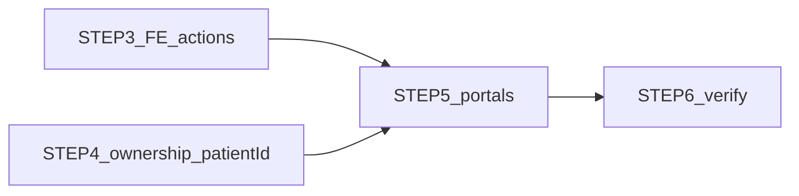

# RBAC STEPS 3–6 Combined Implementation Plan

**Status:** Inspection complete. **No application code changes until you approve this plan.**

**Defaults locked for this plan** (AskQuestion unavailable):
- **Patient prescriptions:** **Limitation** — BE does not authorize `PATIENT` on prescription routes; **no Patient Rx UI** in STEP 5 (do not invent Rx APIs). Profile, appointments, orders only.
- **Pharmacist context:** Manual **patientId** entry; optional open-by **order id / prescription id** using existing `GET /orders/:id` and `GET /prescriptions/:id`. No patient directory/CRUD.

**Already done:** STEP 1 Dashboard; STEP 2 Orders route = ADMIN only.

---

## 1. Current state — STEP 3 (FE actions)

| Location | Finding |
|---|---|
| [`Doctors.tsx`](frontend/src/pages/Doctors.tsx) | `+ Add Doctor` is `isAdmin`; **Edit / Activate-Deactivate still shown to DOCTOR** (BE write is ADMIN-only → 403) |
| [`PatientDetails.tsx`](frontend/src/pages/PatientDetails.tsx) | History **Orders** card still navigates for DOCTOR (route now ADMIN-only → dashboard redirect) |
| [`Appointments.tsx`](frontend/src/pages/Appointments.tsx) / [`AppointmentDetails.tsx`](frontend/src/pages/AppointmentDetails.tsx) | New Appointment already `isAdmin` — OK |
| [`PatientOrders.tsx`](frontend/src/pages/PatientOrders.tsx) | Route ADMIN-only after STEP 2; `!isPharmacist` gates create/delete — fine for ADMIN; status/payment shown to ADMIN (BE allows) |
| [`PatientPrescriptions.tsx`](frontend/src/pages/PatientPrescriptions.tsx) | `isPharmacist` already hides create/delete; page still ADMIN+DOCTOR only — OK for STEP 3 |
| Patient/Pharmacist | No portal pages yet — no extra action gates needed until STEP 5 |

---

## 2. Current state — STEP 4 (BE ownership)

| Area | Finding |
|---|---|
| Patient get/update + dependents/emergency/medical/docs/appt history | [`requirePatientAccess`](backend/src/middleware/patient-access.ts) — ADMIN/DOCTOR any; PATIENT **own only** — **already correct** |
| Document upload/delete | `authorize("ADMIN","DOCTOR")` — PATIENT blocked — OK |
| Order **create** | `authorize("ADMIN","PATIENT")` but **no check** that PATIENT’s `body.patientId` is their linked patient — **IDOR** |
| Order **list/get** | `authorize("ADMIN","PHARMACIST")` only — PATIENT **cannot** read own orders today — **blocks portal**; needs ownership-scoped PATIENT allow |
| Order status/payment | ADMIN+PHARMACIST — PATIENT N — OK (patient manages via create/view; status is pharmacy/admin) |
| Prescriptions | No PATIENT role — **limitation** for portal |
| Login payload | No `patientId` — portal cannot resolve own id without enrichment |

**Schema:** No migration required. Use existing `Patient.userId`.

---

## 3. Current state — STEP 5 (portals)

| Need | Existing API support |
|---|---|
| Patient own profile + sub-resources | Yes via `requirePatientAccess` |
| Patient own appointments | Yes `GET /patients/:id/appointments` |
| Patient own orders create | Yes after STEP 4 ownership |
| Patient own orders read | **Needs STEP 4 authorize + ownership** |
| Patient prescriptions | **Not supported** — skip UI |
| Patient booking / doc upload-delete | Out of scope (do not implement) |
| Pharmacist Rx/Orders by patientId | Yes on prescription/order routes |
| Pharmacist GET patient demographics | **Blocked** by `requirePatientAccess` — show `Patient #id` only |
| Global patient list for PHARMACIST/PATIENT | Must remain unavailable |

---

## 4. Exact files to modify

### STEP 3
- [`frontend/src/pages/Doctors.tsx`](frontend/src/pages/Doctors.tsx)
- [`frontend/src/pages/PatientDetails.tsx`](frontend/src/pages/PatientDetails.tsx)

### STEP 4
- [`backend/src/controllers/order.controller.ts`](backend/src/controllers/order.controller.ts) (+ service helper if cleaner)
- [`backend/src/routes/order.routes.ts`](backend/src/routes/order.routes.ts)
- [`backend/src/services/auth.service.ts`](backend/src/services/auth.service.ts) (login return `patientId` when linked)
- [`frontend/src/context/AuthContext.tsx`](frontend/src/context/AuthContext.tsx) (optional `patientId` on User)
- [`frontend/src/pages/Login.tsx`](frontend/src/pages/Login.tsx) only if needed to pass through `patientId`

### STEP 5
- [`frontend/src/App.tsx`](frontend/src/App.tsx) — PATIENT + PHARMACIST route groups
- [`frontend/src/pages/Dashboard.tsx`](frontend/src/pages/Dashboard.tsx) — portal cards
- **New** thin pages (reuse patterns/CSS; no broad refactor):
  - e.g. `MyPatientProfile.tsx`, `MyAppointments.tsx`, `MyOrders.tsx` (PATIENT)
  - e.g. `PharmacyWorkspace.tsx` or `PharmacyPrescriptions.tsx` + `PharmacyOrders.tsx` (PHARMACIST)
- Soft-reuse of fetch/UI patterns from [`PatientDetails.tsx`](frontend/src/pages/PatientDetails.tsx) / [`PatientOrders.tsx`](frontend/src/pages/PatientOrders.tsx) / [`PatientPrescriptions.tsx`](frontend/src/pages/PatientPrescriptions.tsx) without turning those admin pages into dual-role monsters

### STEP 6
- No product code required beyond fixes found during verification

---

## 5. Exact changes per file

### STEP 3 — Frontend action permissions
1. **Doctors.tsx:** Wrap Edit, Activate/Deactivate (and Delete if present in UI) with `isAdmin`. Keep View Details + Availability for DOCTOR.
2. **PatientDetails.tsx:** Render History Orders card only when `user.role === ADMIN` (Doctor no longer sees it).

### STEP 4 — Backend ownership + security
1. **Order create:** If role is PATIENT, resolve `Patient` where `userId === req.user.userId`; require `Number(body.patientId) === own.id` (or force patientId); else 403. ADMIN unchanged.
2. **Order GET list/by id:** Add PATIENT to authorize **and** enforce ownership (param/body patientId or order.patientId must match own patient). ADMIN/PHARMACIST unchanged.
3. **Login:** Include `patientId: number | null` from linked Patient in login (and register if same payload shape).
4. **AuthContext User:** Optional `patientId`; persist with user JSON.
5. **Do not** weaken `requirePatientAccess`. **No Prisma schema change.**

### STEP 5 — Portals
**Patient (`allowedRoles: PATIENT`):**
- Routes e.g. `/my/profile`, `/my/appointments`, `/my/orders` using auth `patientId`.
- Profile: get/update patient + dependents/emergency/medical; documents **list + download only**.
- Appointments: `GET /patients/:id/appointments` view-only.
- Orders: list/create own only (status update not required for patient if BE keeps status as ADMIN/PHARMACIST).
- Dashboard cards: My Profile / My Appointments / My Orders.
- If missing `patientId`: clear empty state.

**Pharmacist (`allowedRoles: PHARMACIST`):**
- Routes e.g. `/pharmacy` hub: enter patientId → load prescriptions + orders via existing APIs; status/payment updates; hide create/delete Rx and create/delete order (match BE / existing `isPharmacist` patterns).
- Optional: enter orderId/prescriptionId → `GET` by id then work that record.
- Dashboard cards: Prescriptions / Orders (pharmacy).
- **Never** call patient list or patient write APIs.

### STEP 6 — Verification
Manual checklist for ADMIN / DOCTOR / PATIENT / PHARMACIST (login, dashboard, routes, actions, ownership negatives). Run `frontend` `npm run build` and targeted backend typecheck if practical after STEP 4.

---

## 6. Dependencies

- STEP 3 and STEP 4 can proceed in parallel.
- STEP 5 requires STEP 4 (`patientId` + PATIENT order read/create ownership).
- STEP 5 PatientDetails Orders card already fixed in STEP 3 for Doctor.
- STEP 6 after 3–5.

---

## 7. API / backend limitations (accepted)

| Limitation | Impact |
|---|---|
| PATIENT not on prescription APIs | No Patient prescriptions portal section |
| PHARMACIST blocked from `GET /patients/:id` | No patient name/demographics; use Patient #id |
| No global pharmacy queue API | Pharmacist must know a patientId (or order/Rx id) |
| PATIENT cannot patch order status | View/create only (admin/pharmacist fulfill) |
| Doctor↔Doctor link not built | Doctor still sees all appointments (accepted) |

---

## 8. Decisions still required

None blocking if you accept the defaults above. Confirm or override:
1. Skip Patient prescriptions UI (default) vs later minimal GET-own-Rx authorize.
2. Pharmacist patientId entry (+ optional id lookup) vs another approach.

---

## 9. Implementation order

1. **STEP 3** — Doctors write gates + PatientDetails Orders card (ADMIN only)  
2. **STEP 4** — Order ownership + PATIENT read-own orders + login `patientId` + AuthContext  
3. **STEP 5** — App routes + Dashboard cards + Patient pages + Pharmacy pages  
4. **STEP 6** — Four-role verification + builds  

Prefer implementing as one approved phase but committing logically in that order; stop only if schema change appears necessary (not expected).

---

## 10. Verification strategy (STEP 6)

| Role | Must pass |
|---|---|
| ADMIN | All prior admin routes/actions; Orders from patient history; book appointments; doctor write |
| DOCTOR | Patients/details/Rx/appointments view; no New Appointment; no doctor Edit/Deactivate; no Orders card/URL |
| PATIENT | Dashboard portal cards; own profile/appts/orders; cannot `/patients` list; cannot other ids; cannot book; cannot doc upload/delete; cannot create order for other patientId |
| PHARMACIST | No `/patients`; pharmacy workspace by patientId; Rx/order status; no patient CRUD |

Also: unauthenticated → `/login`; wrong-role URL → `/dashboard`.

---

## Out of scope (unchanged)

Doctor↔Doctor linking; patient booking; patient document upload/delete; pharmacist patient CRUD; new patient APIs; SUPPORT/VIEWER; unrelated Phase 2 workflows; Prisma migrations.
