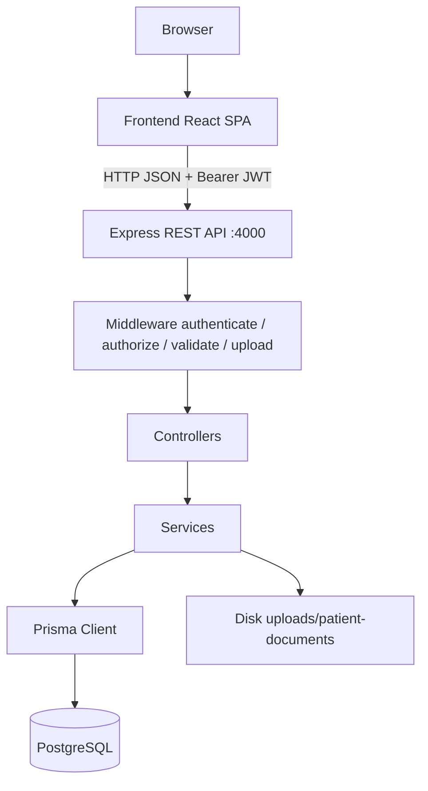
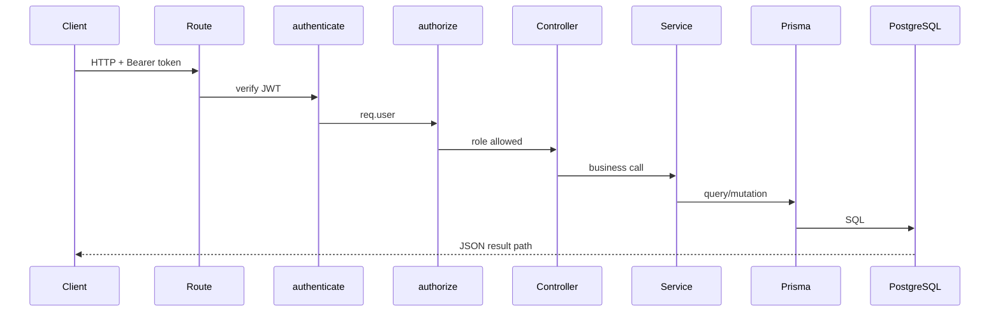

# Architecture

This document describes the **actual** HealthOps architecture as implemented in the repository.

## Overview

HealthOps is a two-application system:

| App | Path | Responsibility |
|-----|------|----------------|
| Frontend | `frontend/` | React SPA — role-based UI, JWT storage, calls REST API |
| Backend | `backend/` | Express REST API — auth, authorization, business rules, Prisma, file uploads |

There is no separate gateway, message bus, or background worker process in the current codebase.



## Frontend architecture

### Stack

- React 19 + TypeScript
- Vite 8 for dev/build
- React Router 7 for client routing
- Axios instance in `frontend/src/services/api.ts` (base URL hardcoded to `http://localhost:4000/api`)
- Auth state in `frontend/src/context/AuthContext.tsx`

### Organization

| Area | Location |
|------|----------|
| Entry | `frontend/src/main.tsx` |
| Routes | `frontend/src/App.tsx` |
| Layout / nav | `frontend/src/components/AppLayout.tsx`, `AppHeader.tsx` |
| Pages | `frontend/src/pages/**` |
| Auth guard | `frontend/src/pages/ProtectedRoute.tsx` |
| API client | `frontend/src/services/api.ts` |

### Routing model

- Public: `/login`, `/register`, `/forgot-password`, `/reset-password`
- Authenticated shell: `ProtectedRoute` + `AppLayout`
- Role-gated groups via `ProtectedRoute allowedRoles={[...]}` (UI only)
- Patient payment iframe target: `/payment-embed` (no app chrome)

Brand name in the header: **HealthOps**.

### Frontend request pattern

1. User action on a page
2. Axios (or occasional `fetch`) to `http://localhost:4000/api/...`
3. Request interceptor attaches `Authorization: Bearer <token>` from localStorage or sessionStorage
4. UI handles success/error JSON (`success`, `message`, `data` patterns used by the API)

**KNOWN LIMITATION:** API base URL is hardcoded; there is no `VITE_*` environment configuration in the frontend.

## Backend architecture

### Stack

- Express 5 application in `backend/src/server.ts`
- TypeScript source; `npm run dev` uses `tsx watch`
- Zod validators
- Prisma 7 with PostgreSQL driver adapter (`@prisma/adapter-pg`)
- JWT + bcrypt for auth
- Multer for multipart uploads

### Layering

```text
server.ts
  → mounts route modules under /api/*
routes/*.ts
  → authenticate / authorize / requirePatientAccess / validate / upload
controllers/*.ts
  → HTTP parse, status codes, call services
validators/*.ts
  → Zod schemas (via validate middleware where wired)
services/*.ts
  → business rules, ownership filters, Prisma access, audit writes
config/prisma.ts
  → PrismaClient + PrismaPg adapter (requires DATABASE_URL)
```

### Route mounts (`server.ts`)

| Mount | Module |
|-------|--------|
| `/api/auth` | Auth |
| `/api/users` | Users |
| `/api/patients` | Patients (+ nested dependents, documents, etc.) |
| `/api/doctors` | Doctors |
| `/api/appointments` | Appointments |
| `/api/appointment-requests` | Appointment requests |
| `/api/prescriptions` | Prescriptions (+ nested refill create) |
| `/api/refill-requests` | Refill/renewal requests |
| `/api/orders` | Orders |
| `/api/medications` | Inventory medications |
| `/api/replenishment-requests` | Replenishment |
| `/api/lab-orders` | Lab test orders |
| `/api/audit-events` | Audit listing |
| `/api/health` | Health check (no auth) |

Listen port is **hardcoded to 4000**.

### Middleware

| Middleware | Role |
|------------|------|
| `cors()`, `express.json()` | Cross-origin + JSON body |
| `authenticate` | Requires Bearer JWT; sets `req.user` |
| `authorize(...roles)` | Role allow-list; 403 if not matched |
| `requirePatientAccess` | ADMIN/DOCTOR any patient; PATIENT only if `patient.userId === req.user.userId` |
| `validate(schema)` | Zod body validation; 400 on failure |
| `patientDocumentUpload` | Multer disk upload with MIME/size limits |

### Controllers and services

Controllers translate HTTP into service calls and map domain errors to status codes. Services own business rules (status transitions, overlaps, eligibility, stock concurrency, audit recording).

### Authentication and authorization placement

- **Authentication** — JWT verification in `authenticate`
- **Authorization** — role lists on routes; additional checks inside services/controllers (ownership, request-type rules, role-specific transitions)
- **Ownership** — patient-linked resources use `requirePatientAccess` and/or controller helpers that compare linked `Patient.userId` to the JWT `userId`

See [AUTH_RBAC.md](./AUTH_RBAC.md).

## Request lifecycle

```text
HTTP Request
  → Express route
  → authenticate (Bearer JWT)          [most routes]
  → authorize(roles...)                [most routes]
  → optional requirePatientAccess / upload / validate
  → controller
  → service (business rules)
  → Prisma Client
  → PostgreSQL
  → JSON response
```



## Prisma and PostgreSQL

- Schema: `backend/prisma/schema.prisma`
- Migrations: `backend/prisma/migrations/`
- Prisma config: `backend/prisma.config.ts` (datasource URL from `DATABASE_URL`)
- Generated client output: `backend/src/generated/prisma`
- Runtime: `backend/src/config/prisma.ts` throws if `DATABASE_URL` is missing

Details: [DATABASE.md](./DATABASE.md).

## File storage

**IMPLEMENTED:** local disk storage via Multer.

- Directory: `<backend cwd>/uploads/patient-documents`
- Used for patient documents and lab result file uploads
- Allowed MIME types include PDF, JPEG, PNG, WebP, plain text, DOC/DOCX
- Max size: 10 MB

There is no cloud object-storage integration in the current code.

## Major integrations

| Integration | Status |
|-------------|--------|
| PostgreSQL | **IMPLEMENTED** |
| Local file system uploads | **IMPLEMENTED** |
| Email delivery (password reset) | **KNOWN LIMITATION** — token logged / returned for development; no mailer |
| External payment processor | **KNOWN LIMITATION** — payment status updated in-app (demo UI) |
| External courier / tracking | **KNOWN LIMITATION** — shipment tracking UI is demo-oriented |

## Cross-cutting concerns

### Audit

Domain services call `safeRecordAuditEvent` so audit write failures are logged and do not block the primary operation. Readable via `/api/audit-events` for ADMIN, VIEWER, SUPPORT.

### CORS

Backend enables `cors()` broadly for local SPA access.

### Error style

Typical JSON: `{ success: false, message: "..." }` with HTTP 400/401/403/404/409/500 as mapped by controllers.

## Related documents

- [MODULES.md](./MODULES.md) — features by domain
- [AUTH_RBAC.md](./AUTH_RBAC.md) — security model
- [WORKFLOWS.md](./WORKFLOWS.md) — end-to-end flows
- [SETUP_GUIDE.md](./SETUP_GUIDE.md) — run locally
- [docs/API_GUIDE_EntryPoint.md](../docs/API_GUIDE_EntryPoint.md) — API reference entry
