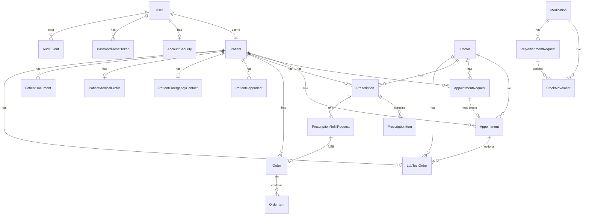

# Database

HealthOps persists data in **PostgreSQL** through **Prisma ORM** (v7) using the `@prisma/adapter-pg` driver adapter.

## Technology

| Item | Value |
|------|--------|
| Database | PostgreSQL |
| ORM | Prisma (`backend/prisma/schema.prisma`) |
| Config | `backend/prisma.config.ts` — `DATABASE_URL` |
| Client runtime | `backend/src/config/prisma.ts` |
| Generated client | `backend/src/generated/prisma` |
| Migrations | `backend/prisma/migrations/` |

`DATABASE_URL` is required. The Prisma client throws at startup if it is missing.

## Migrations

Schema evolution is managed with Prisma migrations under `backend/prisma/migrations/`. Apply with:

```bash
cd backend
npx prisma migrate deploy
npx prisma generate
```

(See [SETUP_GUIDE.md](./SETUP_GUIDE.md).)

## Domain overview



## Major models (conceptual)

### Identity & security

| Model | Purpose |
|-------|---------|
| `User` | Login identity: name, email, password hash, role, status |
| `AccountSecurity` | Failed login attempts, lockout timestamp, password-changed marker |
| `PasswordResetToken` | Hashed reset tokens with expiry and used flag |

### Clinical party data

| Model | Purpose |
|-------|---------|
| `Patient` | Patient record; optional `userId` link to portal account; unique `medicalId` |
| `Doctor` | Provider registry (codes, license, specialization, status) — **not** FK-linked to `User` |
| `PatientDependent` | Dependents for a patient |
| `PatientEmergencyContact` | One emergency contact per patient |
| `PatientMedicalProfile` | Conditions, allergies, medications, notes |
| `PatientDocument` | Uploaded file metadata + path |

### Scheduling

| Model | Purpose |
|-------|---------|
| `Appointment` | Scheduled visit with status/type/duration |
| `AppointmentRequest` | Patient-submitted request; may link to created appointment |

### Pharmacy clinical & commerce

| Model | Purpose |
|-------|---------|
| `Prescription` / `PrescriptionItem` | Rx header + line items |
| `PrescriptionRefillRequest` | Refill or renewal workflow; optional linked order |
| `Order` / `OrderItem` | Patient order + line items, order/payment status |

### Inventory

| Model | Purpose |
|-------|---------|
| `Medication` | SKU inventory with reorder fields |
| `ReplenishmentRequest` | Restock workflow |
| `StockMovement` | Quantity delta history |

### Lab & audit

| Model | Purpose |
|-------|---------|
| `LabTestOrder` | Lab order, result fields, optional result document link |
| `AuditEvent` | Append-only audit row (actor, action, entity, metadata JSON) |

## Important ownership relationships

| Relationship | Meaning |
|--------------|---------|
| `Patient.userId` → `User.id` | Portal ownership; used by patient-access checks |
| Appointments / prescriptions / orders / lab orders → `patientId` | Belong to a patient |
| Prescriptions / appointments / lab orders → `doctorId` | Reference registry doctor |
| Refill / appointment / replenishment requests → `requestedByUserId` | Acting user |
| Orders ← refill request `orderId` | Optional 1:1 fulfillment link |

**KNOWN LIMITATION:** `User.role = DOCTOR` does not automatically map to a `Doctor` row.

## Important enums / statuses

| Enum | Values (high level) |
|------|---------------------|
| `UserRole` | ADMIN, DOCTOR, PHARMACIST, PATIENT, SUPPORT, VIEWER |
| `UserStatus` | ACTIVE, INACTIVE, LOCKED |
| `PatientStatus` | ACTIVE, INACTIVE, DECEASED |
| `DoctorStatus` | ACTIVE, INACTIVE, ON_LEAVE |
| `AppointmentStatus` | SCHEDULED → … → COMPLETED / CANCELLED / NO_SHOW |
| `AppointmentType` | IN_PERSON, VIDEO, PHONE |
| `AppointmentRequestStatus` | SUBMITTED, APPROVED, REJECTED, CANCELLED |
| `PrescriptionStatus` | ACTIVE, COMPLETED, CANCELLED |
| `OrderStatus` | PENDING, CONFIRMED, PROCESSING, SHIPPED, DELIVERED, CANCELLED |
| `PaymentStatus` | PENDING, PAID, FAILED, REFUNDED |
| `RefillRequestType` | REFILL, RENEWAL |
| `RefillRequestStatus` | SUBMITTED, APPROVED, REJECTED, CANCELLED, FULFILLED |
| `MedicationStatus` | ACTIVE, INACTIVE |
| `ReplenishmentRequestStatus` | SUBMITTED, APPROVED, REJECTED, CANCELLED, RECEIVED |
| `LabTestOrderStatus` | REQUESTED, SAMPLE_COLLECTED, PROCESSING, RESULT_AVAILABLE, ACKNOWLEDGED, CANCELLED, REJECTED |
| `LabResultFlag` | NORMAL, ABNORMAL, CRITICAL |

Transition rules are enforced in services, not only by enum membership. See [WORKFLOWS.md](./WORKFLOWS.md).

## Important constraints (examples)

- Unique: user email, patient medicalId, doctor codes/license/email, appointment/order/prescription/request numbers, medication SKU
- Cascades: many patient-owned children delete with patient
- Indexes: common filters on patientId, doctorId, status, dates
- Decimal money fields on orders use `Decimal(10, 2)`

## What this document does not do

It does not dump the full Prisma schema. For exact fields and relations, open `backend/prisma/schema.prisma`.

## Related documents

- [ARCHITECTURE.md](./ARCHITECTURE.md)
- [AUTH_RBAC.md](./AUTH_RBAC.md)
- [WORKFLOWS.md](./WORKFLOWS.md)
- [SETUP_GUIDE.md](./SETUP_GUIDE.md)
