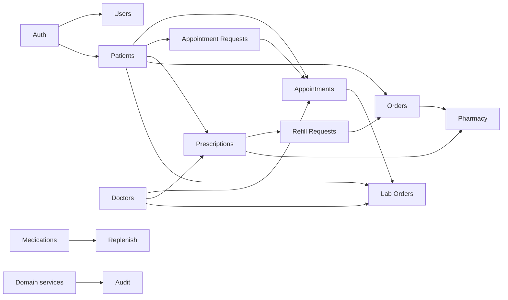

# Modules

Functional modules **as implemented** in HealthOps. Each section reflects frontend pages and backend resources present in the repository.

For HTTP details, see [`docs/API_INVENTORY.md`](../docs/API_INVENTORY.md). For state machines, see [WORKFLOWS.md](./WORKFLOWS.md).

---

## 1. Authentication & account security

**Status:** IMPLEMENTED

**Purpose:** Register users, issue JWTs, reset/change passwords, lock accounts after failed logins.

**What it does**

- Public register for `PATIENT`, `DOCTOR`, `PHARMACIST` (not `ADMIN`)
- Patient registration also creates a linked `Patient` record (`medicalId` like `PAT-00025`)
- Login with optional remember-me (token TTL 1h vs 30d)
- Forgot/reset password (dev token return + console log)
- Authenticated change-password and logout contract endpoint
- Failed-login lockout (5 attempts → 15 minutes)

**Roles:** all authenticated users for change-password/logout; public for register/login/reset.

**Frontend:** `/login`, `/register`, `/forgot-password`, `/reset-password`, `/change-password`

**Backend:** `/api/auth/*`

**Related:** User management (admin-created accounts); Patient module (linked profile on patient register)

---

## 2. User management

**Status:** IMPLEMENTED

**Purpose:** Admin management of application users.

**What it does**

- List/get/create/update/delete users
- Roles assignable via admin validators include ADMIN, DOCTOR, PHARMACIST, SUPPORT, VIEWER (not PATIENT through this path)

**Roles:** `ADMIN` only

**Frontend:** no dedicated users page; admin bootstrap via script / API

**Backend:** `/api/users`

---

## 3. Patients

**Status:** IMPLEMENTED

**Purpose:** Maintain patient demographic and clinical-support records.

**What it does**

- CRUD-style patient management (list/create for ADMIN/DOCTOR; get/update with ownership middleware)
- Soft deactivate (`INACTIVE`); hard delete (ADMIN)
- Dependents, emergency contact, medical profile
- Document upload/list/download/delete (upload/delete ADMIN/DOCTOR; view/download via patient access rules)
- Patient appointment history listing

**Important rules**

- `requirePatientAccess`: ADMIN/DOCTOR any patient; PATIENT only own linked record
- Document upload restricted to ADMIN/DOCTOR

**Roles:** ADMIN, DOCTOR, PATIENT (own record)

**Frontend:** `/patients`, `/patients/:id`, `/my/profile`

**Backend:** `/api/patients/...`

**Related:** Appointments, prescriptions, orders, lab orders, refill requests

---

## 4. Doctors (provider registry)

**Status:** IMPLEMENTED

**Purpose:** Maintain the clinical provider registry used by appointments, prescriptions, and lab orders.

**What it does**

- List/get doctors (ADMIN, DOCTOR, PATIENT)
- Create/update/delete (ADMIN)
- Status: ACTIVE, INACTIVE, ON_LEAVE

**Important rules**

- `Doctor` model is **not** linked by foreign key to `User`
- A user with role `DOCTOR` is separate from a `Doctor` registry row (**KNOWN LIMITATION** / modeling gap)

**Roles:** ADMIN (write), ADMIN/DOCTOR/PATIENT (read)

**Frontend:** `/doctors`

**Backend:** `/api/doctors`

---

## 5. Appointments

**Status:** IMPLEMENTED

**Purpose:** Schedule and advance clinical appointments.

**What it does**

- ADMIN creates appointments
- ADMIN/DOCTOR list and view
- Status lifecycle with validated transitions and role-limited targets
- ADMIN updates schedule/details; ADMIN cancels SCHEDULED via DELETE
- Overlap prevention for doctor and patient on active statuses

**Roles:** ADMIN, DOCTOR (patients view own history via patient appointments endpoint / portal)

**Frontend:** `/appointments`, `/appointments/new`, `/appointments/:id`, `/my/appointments`

**Backend:** `/api/appointments`, `GET /api/patients/:id/appointments`

**Related:** Appointment requests (approval creates an appointment)

---

## 6. Appointment requests

**Status:** IMPLEMENTED

**Purpose:** Let patients request appointments for staff review.

**What it does**

- PATIENT submits request
- ADMIN/DOCTOR/PATIENT list/get with ownership filtering for patients
- Approve → creates `Appointment` and links it; reject/cancel with rules
- Duplicate submitted / overlap checks

**Roles:** PATIENT (create/cancel own), ADMIN/DOCTOR (review)

**Frontend:** `/my/appointments/request`, `/appointment-requests`

**Backend:** `/api/appointment-requests`

---

## 7. Prescriptions

**Status:** IMPLEMENTED

**Purpose:** Capture prescribed medications for a patient under a doctor.

**What it does**

- ADMIN/DOCTOR create prescriptions with line items
- List by patient / get by id (includes PATIENT with ownership checks)
- Status updates: ACTIVE / COMPLETED / CANCELLED (ADMIN/DOCTOR/PHARMACIST)
- Delete (ADMIN/DOCTOR)

**Roles:** ADMIN, DOCTOR, PHARMACIST, PATIENT (read own)

**Frontend:** `/patients/:id/prescriptions`, `/my/prescriptions`, pharmacy workspace

**Backend:** `/api/prescriptions`

**Related:** Refill/renewal requests

---

## 8. Refill / renewal requests

**Status:** IMPLEMENTED

**Purpose:** Request refill or renewal against an existing prescription; fulfill via order.

**What it does**

- Create via `POST /api/prescriptions/:id/refill-requests` (ADMIN, PHARMACIST, PATIENT)
- PHARMACIST cannot create RENEWAL; DOCTOR cannot create requests
- Review approve/reject/cancel with role rules (pharmacist may approve REFILL only)
- Create order from APPROVED request (ADMIN, PATIENT) → FULFILLED

**Roles:** ADMIN, DOCTOR, PHARMACIST, PATIENT (as constrained above)

**Frontend:** `/refill-requests`, patient prescriptions UI

**Backend:** `/api/refill-requests`, nested create under prescriptions

**Related:** Prescriptions, Orders

---

## 9. Orders & payments

**Status:** IMPLEMENTED (payment processor: KNOWN LIMITATION — in-app status only)

**Purpose:** Medication/product orders for patients with fulfillment and payment status.

**What it does**

- Create orders (ADMIN, PATIENT with ownership)
- List/get with patient ownership enforcement
- Order status updates (ADMIN, PHARMACIST)
- Payment status updates (ADMIN, PHARMACIST, PATIENT — patient limited to PAID/FAILED on own order)
- Delete (ADMIN)

**Frontend:** `/patients/:id/orders`, `/my/orders`, `/my/orders/:orderId/pay`, `/payment-embed`, `/my/orders/:orderId/tracking`

**Backend:** `/api/orders`

**Related:** Pharmacy workspace, refill fulfillment

**Shipment tracking:** demo-oriented UI (**KNOWN LIMITATION**)

---

## 10. Pharmacy workspace

**Status:** IMPLEMENTED

**Purpose:** Pharmacist operational lookup and status updates for a patient’s prescriptions and orders.

**What it does**

- Lookup by patient / order / prescription identifiers
- Update order, payment, and prescription statuses (via existing APIs)

**Roles:** PHARMACIST (UI); APIs also allow ADMIN where authorized

**Frontend:** `/pharmacy`

**Backend:** uses `/api/prescriptions` and `/api/orders`

---

## 11. Medication inventory

**Status:** IMPLEMENTED

**Purpose:** Track medication SKUs, on-hand quantity, reorder thresholds, and stock movements.

**What it does**

- CRUD-style medication management (create/update/list/get)
- Stock adjust with movement history
- ACTIVE/INACTIVE medication status; no negative stock

**Roles:** ADMIN, PHARMACIST

**Frontend:** `/inventory`

**Backend:** `/api/medications`

**Related:** Replenishment requests

---

## 12. Replenishment requests

**Status:** IMPLEMENTED

**Purpose:** Request restock for medications and receive inventory.

**What it does**

- Create request (ADMIN, PHARMACIST) against ACTIVE medication
- Prevent duplicate open requests
- ADMIN approve/reject; requester or ADMIN cancel SUBMITTED
- Receive approved stock → increases quantity and records movement

**Roles:** ADMIN, PHARMACIST

**Frontend:** `/replenishment-requests`

**Backend:** `/api/replenishment-requests`

---

## 13. Lab test orders

**Status:** IMPLEMENTED

**Purpose:** Order lab tests, progress samples, upload results, acknowledge for patient visibility.

**What it does**

- ADMIN/DOCTOR create and manage status transitions (role-specific)
- ADMIN uploads results (moves to RESULT_AVAILABLE)
- ADMIN/DOCTOR acknowledge → patient can see results
- PATIENT lists/views own orders; results stripped until ACKNOWLEDGED
- Optional link to appointment; result file may become a patient document

**Roles:** ADMIN, DOCTOR, PATIENT

**Frontend:** `/lab-orders`, `/lab-orders/:id`, `/my/lab-orders`, `/my/lab-orders/:id`

**Backend:** `/api/lab-orders`

---

## 14. Audit events

**Status:** IMPLEMENTED

**Purpose:** Append-only operational audit trail for important domain actions.

**What it does**

- Services record CREATE/UPDATE/STATUS_CHANGE/APPROVE/REJECT/CANCEL/DELETE style events
- Filtered listing API for ADMIN, VIEWER, SUPPORT
- Failures are swallowed by `safeRecordAuditEvent` so business ops continue

**Roles:** ADMIN, VIEWER, SUPPORT (read)

**Frontend:** `/audit-logs`

**Backend:** `/api/audit-events`

---

## Module relationship diagram

