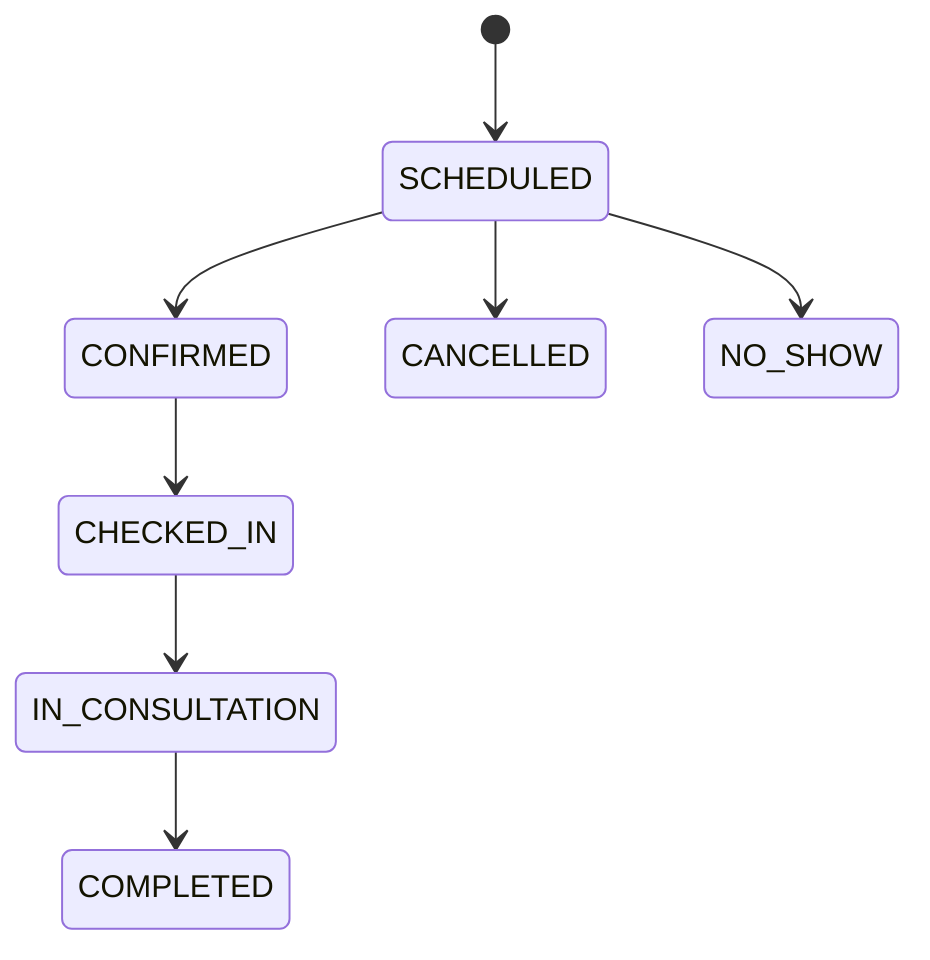
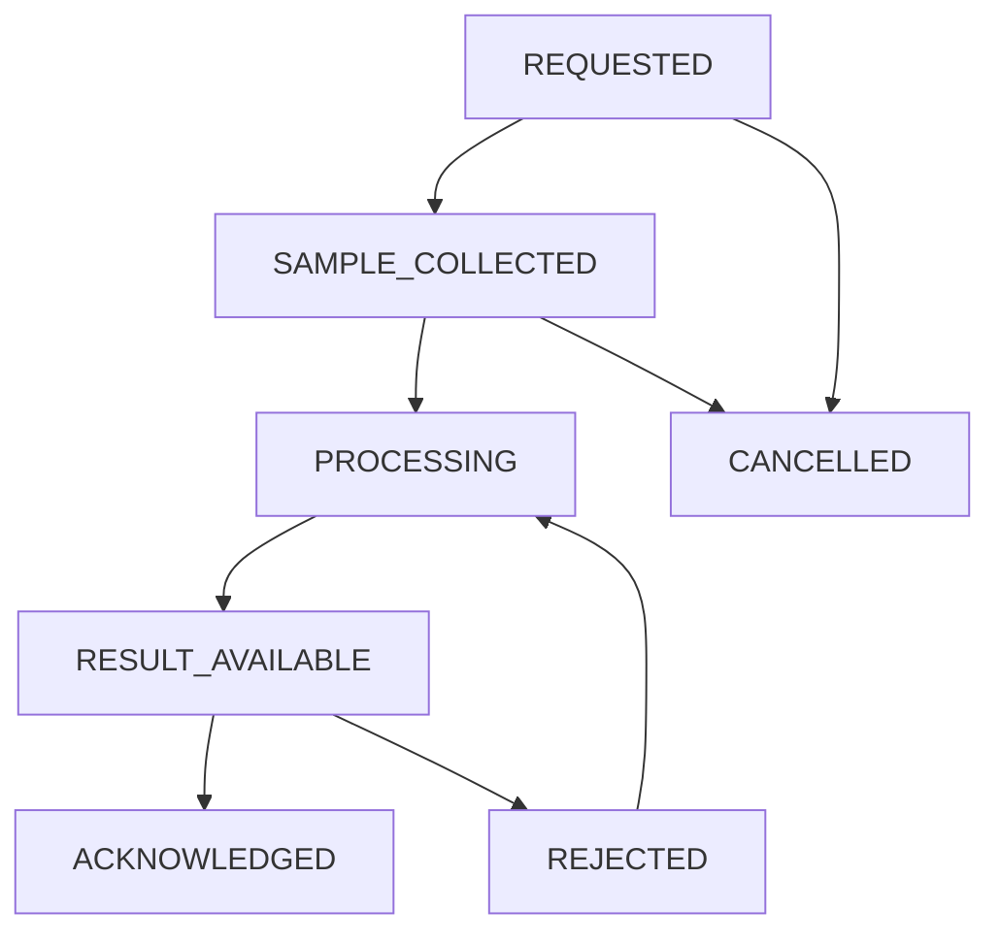

# Workflows

End-to-end workflows that are **actually implemented** in HealthOps. Each flow lists actors, steps, state transitions, rules, and dependencies.

For API paths and roles, see [`docs/API_INVENTORY.md`](../docs/API_INVENTORY.md).

---

## 1. Authentication workflow

**Actors:** any user (register limited roles); admin bootstrap script for ADMIN

**Start:** register or login pages / API

**Steps**

1. Register (PATIENT/DOCTOR/PHARMACIST) or use admin script / admin-created user
2. Login with email/password (± remember-me)
3. Receive JWT; frontend stores token
4. Call APIs with Bearer token
5. Optional: forgot → reset token → set new password; or change password while logged in
6. Logout clears client token

**Rules**

- Lockout after 5 failed logins (15 minutes)
- Inactive/locked users cannot login
- Reset tokens expire in 15 minutes

**Dependencies:** `User`, `AccountSecurity`, `PasswordResetToken`

**KNOWN LIMITATION:** reset email delivery not implemented

---

## 2. Appointment workflow

**Actors:** ADMIN (create/manage), DOCTOR (status progression), PATIENT (view own history)

**Start:** Admin creates appointment (`/appointments/new` or API), or appointment request approval (see below)

**Status transitions (service-enforced)**

```text
SCHEDULED → CONFIRMED | CANCELLED | NO_SHOW
CONFIRMED → CHECKED_IN
CHECKED_IN → IN_CONSULTATION
IN_CONSULTATION → COMPLETED
COMPLETED / CANCELLED / NO_SHOW → (terminal)
```

**Role targets**

- ADMIN may move to: CONFIRMED, CHECKED_IN, IN_CONSULTATION, COMPLETED, CANCELLED, NO_SHOW (when transition allowed)
- DOCTOR may move to: CONFIRMED, CHECKED_IN, IN_CONSULTATION, COMPLETED, NO_SHOW (not CANCELLED via status API)
- DELETE cancel: ADMIN only, and only from SCHEDULED

**Rules**

- Doctor must be ACTIVE to schedule
- No past start times on create/update
- Overlap blocked for doctor and patient among SCHEDULED/CONFIRMED/CHECKED_IN/IN_CONSULTATION
- Terminal appointments not editable

**Dependencies:** Patient, Doctor



---

## 3. Appointment request workflow

**Actors:** PATIENT (submit/cancel own), ADMIN/DOCTOR (approve/reject)

**Start:** Patient `/my/appointments/request`

**Steps**

1. Patient submits request for active doctor (future time)
2. Status `SUBMITTED`
3. Staff approve → creates `Appointment` (SCHEDULED) and links `appointmentId`; or reject (reason required); or cancel (patient requester/admin rules in service)
4. Terminal: APPROVED / REJECTED / CANCELLED

**Rules**

- Patient must be ACTIVE and own the patient link
- Doctor ACTIVE
- Duplicate SUBMITTED for same slot pattern blocked
- Overlap checks against existing active appointments

**Dependencies:** Patient, Doctor, Appointment (on approve)

---

## 4. Prescription workflow

**Actors:** ADMIN/DOCTOR (create), ADMIN/DOCTOR/PHARMACIST (status), PATIENT (read own)

**Start:** Patient detail prescriptions UI or API create

**Steps**

1. Create prescription with one or more items for patient + doctor
2. Status defaults ACTIVE
3. Update to COMPLETED or CANCELLED as appropriate
4. Optional delete (ADMIN/DOCTOR)

**Statuses:** ACTIVE · COMPLETED · CANCELLED

**Dependencies:** Patient, Doctor; enables refill workflow

---

## 5. Refill / renewal workflow

**Actors:** PATIENT/ADMIN/PHARMACIST (create with constraints), ADMIN/DOCTOR/PHARMACIST (review), PATIENT/ADMIN (create order)

**Start:** `POST /api/prescriptions/:id/refill-requests` or patient UI

**Steps**

1. Create REFILL or RENEWAL against eligible prescription
2. `SUBMITTED`
3. Approve / Reject / Cancel per role rules
4. If APPROVED → `POST .../create-order` creates Order and marks request `FULFILLED`

**Eligibility (high level)**

- Patient ACTIVE; prescription not CANCELLED
- REFILL requires prescription ACTIVE
- RENEWAL allows ACTIVE or COMPLETED
- One SUBMITTED request at a time per prescription
- PHARMACIST cannot create/approve RENEWAL; DOCTOR cannot create

**Statuses:** SUBMITTED → APPROVED | REJECTED | CANCELLED; APPROVED → FULFILLED (via order create)

**Dependencies:** Prescription, Patient, Order

---

## 6. Order & payment workflow

**Actors:** ADMIN/PATIENT (create), ADMIN/PHARMACIST (fulfillment statuses), PATIENT (pay own)

**Start:** Admin patient orders UI, patient portal, or refill fulfillment

**Order statuses:** PENDING → CONFIRMED → PROCESSING → SHIPPED → DELIVERED (or CANCELLED)

**Payment statuses:** PENDING · PAID · FAILED · REFUNDED

**Steps**

1. Create order with line items and total
2. Pharmacy/admin advances order status
3. Patient opens pay UI → simulated payment form → API sets payment to PAID or FAILED
4. Optional demo shipment tracking page

**Rules**

- PATIENT only on own patientId
- PATIENT payment updates limited to PAID/FAILED

**KNOWN LIMITATION:** no external payment gateway; tracking is demo UI

**Dependencies:** Patient; optional RefillRequest link

---

## 7. Pharmacy workspace workflow

**Actors:** PHARMACIST

**Start:** `/pharmacy`

**Steps**

1. Look up patient prescriptions and/or orders by id
2. Update prescription status, order status, payment status as needed
3. Coordinate with refill review and inventory screens

**Dependencies:** Prescription and Order APIs

---

## 8. Inventory & replenishment workflow

**Actors:** ADMIN, PHARMACIST

### Stock maintenance

1. Create/update medication (SKU, quantities, reorder levels)
2. Adjust stock (± delta) with reason → `StockMovement` row
3. Cannot drive quantity negative; inactive meds cannot be adjusted

### Replenishment

```text
SUBMITTED → APPROVED | REJECTED | CANCELLED
APPROVED → RECEIVED (stock increased)
```

**Rules**

- Only ACTIVE medications
- No duplicate open (SUBMITTED/APPROVED) request per medication
- ADMIN approves/rejects; cancel by ADMIN or requester while SUBMITTED
- Receive records movement and sets RECEIVED

**Dependencies:** Medication, StockMovement, User (actor)

---

## 9. Lab order workflow

**Actors:** ADMIN/DOCTOR (clinical), ADMIN (result upload), PATIENT (view after acknowledge)

**Start:** `/lab-orders` create

**Typical happy path**

```text
REQUESTED
  → SAMPLE_COLLECTED (ADMIN)
  → PROCESSING (ADMIN)
  → RESULT_AVAILABLE (ADMIN uploads result)
  → ACKNOWLEDGED (ADMIN/DOCTOR)
```

Also: cancel early from REQUESTED/SAMPLE_COLLECTED; reject RESULT_AVAILABLE (reason); PROCESSING can resume from REJECTED.

**Patient visibility**

- Until ACKNOWLEDGED, result fields are stripped for patient responses
- After acknowledge, patient can view/download (file path internals still controlled)

**Rules**

- Doctor must be ACTIVE on create
- Optional appointment must match patient/doctor
- Result immutable after ACKNOWLEDGED

**Dependencies:** Patient, Doctor, optional Appointment, PatientDocument on acknowledge



---

## 10. Audit workflow

**Actors:** System (writers via services); ADMIN / VIEWER / SUPPORT (readers)

**Start:** Domain mutation that calls `safeRecordAuditEvent`

**Steps**

1. Business operation succeeds
2. Audit row appended (best effort)
3. Staff filter/list events in `/audit-logs`

**Dependencies:** `AuditEvent`; does not block primary transactions on failure

---

## Workflows not present

The following are **not** documented as implemented because they are not present as end-to-end product workflows beyond what is above: external billing clearance, insurer claims, real courier webhooks, email/SMS notification pipelines, or Doctor-user account linking.

---

## Related documents

- [MODULES.md](./MODULES.md)
- [AUTH_RBAC.md](./AUTH_RBAC.md)
- [DATABASE.md](./DATABASE.md)
- [docs/API_TEST_CASES.md](../docs/API_TEST_CASES.md)
